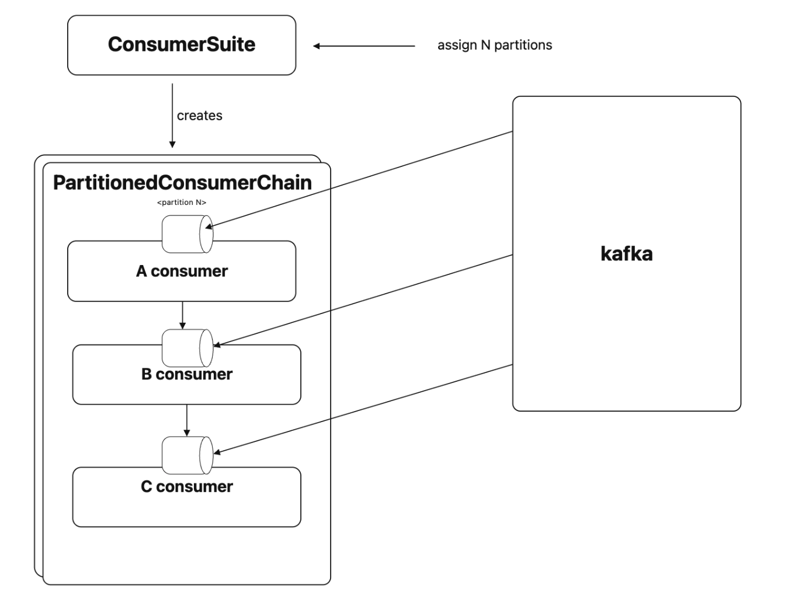
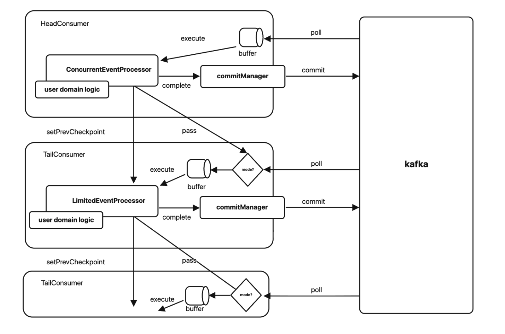

출처: [AB180 — 순서대로, 한 번만, 빠르게](https://engineering.ab180.co/stories/kafka-event-ordering-at-scale)

## Airbridge와 이벤트 처리 순서

`Airbridge`는 광고를 통해 유입된 사용자의 행동을 분석하고, 어떤 광고가 실제 성과로 이어지는지 측정하는 서비스다.

다루는 이벤트에는 다음과 같은 종류가 있다.

- 광고 클릭
- 앱 설치
- 구매

이러한 이벤트를 실시간으로 매칭해야 한다. 이때 빨리 처리하는 만큼 어떤 순서로 처리하는지가 중요하다.

- 예를 들어 광고 클릭보다 설치 이벤트가 먼저 처리될 수 있음
- 앞선 행동이 반영되기 전에 후속 이벤트를 처리하면 정확한 성과 측정이 어려울 수 있음
- 중복이나 유실도 없어야 함

## 초기 시스템과 워크로드 분리

초기 `Airbridge` 분석 시스템은 `Python`으로 구현된 하나의 거대한 서버에 많은 비즈니스 로직이 모여 있는 구조였다.

제품과 트래픽이 성장하며 서버를 워크로드별로 분리하기 시작했다.

- 워크로드의 특성에 따라 `Rust`, `Go`로 마이그레이션
- 일부는 기존 `Python` 구현 유지

분리 이후의 이벤트 처리 흐름은 다음과 같다.

1. `Go`로 구현한 `Preprocessor`가 이벤트를 공통 형식으로 전처리
2. `Kafka`에 전달
3. `gRPC Worker`가 해당 이벤트를 `consume`
4. 이벤트 종류에 따라 적절한 비즈니스 로직 워커로 요청을 라우팅
5. 각 워커가 처리를 완료하고 응답
6. `gRPC Worker`가 완료된 이벤트의 `offset`을 `Kafka`에 `commit`

### 실제 운영에서 마주한 차이

워커마다 특성이 매우 달랐다. 특정 워커는 평균 처리 시간이 짧고 처리량이 높지만, 어떤 워커는 복잡한 계산을 수행하며 상대적으로 느렸다. 특정 이벤트에만 트래픽 스파이크가 발생하는 경우도 있었다.

서버를 분리한다고 문제가 저절로 해결되지는 않았다.

- 한 서버에서 제어하던 처리 순서를 여러 서버 사이에서도 지켜야 함
- 처리 속도가 다른 워커들을 쉬지 않게 하면서 이벤트를 한 번만 처리해야 함

### 지켜야 하는 세 가지 조건

1. 비즈니스 로직이 요구하는 처리 순서를 최대한 지켜야 함
2. 처리한 이벤트가 유실되거나 중복 처리되지 않아야 함
3. 워커별 처리 속도 차이를 존중하면서 전체 처리량을 높여야 함

## 서버를 늘려도 처리 속도가 빨라지지 않았던 이유

기존 `gRPC Worker`는 `Kafka`에서 `N`개의 메시지를 마이크로 배치로 가져온 후, 배치 안의 이벤트를 필요한 순서에 따라 처리했다.

`A` 유형을 먼저 처리해야 한다면 배치의 `A` 이벤트를 모두 처리하고 `B`, `C`를 처리하는 방식이다.

### 워커의 관점에서 생기는 비효율

`A` 이벤트를 처리하는 동안 `B`, `C` 워커는 할 일이 없다. `B` 이벤트 차례가 오면 이번에는 `A` 워커와 `C` 워커가 쉬게 된다.

이 문제는 각 워커의 처리 속도가 다를 때 더욱 커진다.

- 배치 안에 느린 이벤트가 하나라도 섞이면 뒤에 있는 모든 이벤트가 기다려야 함
- 특정 `Kafka Partition`으로 트래픽이 몰리는 핫 파티션 문제까지 겹치면 대기 시간이 더욱 길어짐

**일할 수 있는 워커도 앞선 순서를 기다리느라 쉬고 있는 것이 문제였다.**

이를 해결하기 위해 순서를 지키면서 처리 속도를 높이는 구조인 `Project Differential`을 고안했다. 원문에서는 이벤트 유실과 중복 없이 기존 대비 10배 이상의 처리 속도를 달성했다고 설명한다.

## Watermark에서 얻은 힌트

현실의 분산 시스템에서는 오래전에 발생한 이벤트가 네트워크 지연 등의 이유로 뒤늦게 도착할 수 있다.

무한정 기다리면 일을 끝낼 수 없기 때문에, 일정 범위까지만 기다린 뒤 특정 시점 이전의 계산을 완료한 것으로 간주하는 접근이 필요하다.

이를 위해 조사한 실시간 처리 시스템의 개념은 다음과 같다.

- `Apache Flink`의 `Watermark`
- `Spark`의 `Watermark`

`Flink`는 일정 범위의 순서 뒤바뀜을 허용하는 `Bounded out-of-orderness` 같은 전략을 제공한다. 여기서 `Watermark`는 이벤트 시간의 진행과 늦게 도착한 데이터를 다루기 위한 개념이다.

### 모든 이벤트를 시간순으로 정렬할 필요는 없음

`Airbridge`에서 필요한 것은 다음 두 가지였다.

- 이벤트 종류 사이의 처리 순서를 지키기
- 처리 속도 극대화하기

워크로드의 특성을 바탕으로 안전 범위를 정하고, 그 범위 안에서 `Best Effort`로 순서를 지키는 접근이 필요했다.

## Project Differential

각 워커가 자신의 속도로 쉬지 않고 일하면서, 앞서 처리해야 할 워커를 추월하지 않게 만들 수는 없을까?

- 마이크로 배치를 없앰
- 이벤트 종류별 `Consumer`가 하나의 `Kafka Topic`을 독립적으로 읽음
- 각 `Consumer`는 자신의 속도로 이벤트를 처리
- 뒤따르는 `Consumer`는 앞선 `Consumer`의 처리 위치를 추월할 수 없음

이를 통해 `Consumer` 간 처리 순서를 유지하면서도 워커의 유휴 시간을 줄일 수 있다.

모든 워커를 같은 배치 속도에 맞추는 대신, 워커마다 자신의 처리 속도로 일하되 전체 순서가 허용 범위를 벗어나지 않도록 하는 것이다.

### 하나의 Topic을 여러 Consumer가 읽음

- 이벤트 종류별로 `Consumer`를 정의
- 각 `Consumer`는 동일한 `Kafka Topic`을 읽음
- 자신이 처리해야 하는 이벤트는 처리하고, 다른 종류의 이벤트는 다음 `Consumer`로 넘김
- 뒤의 `Consumer`는 앞선 `Consumer`의 처리 `offset`을 추월하지 않음
- 두 `Consumer` 사이에는 `offset` 또는 `event time`을 기준으로 안전거리를 둠

순서 보장 단위는 `Kafka Topic` 전체가 아닌 `Partition`이다. 순서가 중요한 동일 사용자 흐름의 이벤트는 가능한 한 같은 `Partition`으로 들어가도록 `Partition Key`를 설정한다.

`A`, `B Consumer`가 있다면 `B Consumer`는 `A Consumer`보다 일정 `offset` 또는 일정 시간 뒤에서 이벤트를 처리한다.

`A`가 빠르거나 `B`가 느리더라도 둘을 하나의 배치에 묶지 않는다. 각 `Consumer`는 가능한 일을 계속 처리하지만, `B`가 `A`를 추월하려는 순간에는 처리를 제한한다.

배치 전체를 기다릴 필요 없이 앞 `Consumer`의 처리 위치를 추월하지 않는 범위에서 계속 이벤트를 처리한다. 느린 이벤트가 전체 배치를 멈추게 하던 대기 시간이 줄어든다.

### 모든 이벤트에 대한 전역 완전 순서는 아님

`Differential`은 모든 이벤트에 대한 전역 완전 순서를 만드는 시스템이 아니다.

- 광고 클릭 이벤트
  - 사용자가 광고를 클릭하면 `Airbridge` 서버를 거쳐 가며 이벤트를 남김
  - 이벤트가 뒤늦게 수집되는 일은 거의 없음
- 모바일 앱 이벤트
  - 네트워크 지연이나 앱의 백그라운드 이동 등으로 서버에 뒤늦게 도착할 수 있음
  - `SDK`에서 이벤트를 전송할 때 종종 순서가 어긋남

이러한 차이를 고려해 몇 초 정도의 `event time` 차이를 기준으로 사용했다. 광고 클릭으로부터 몇 초 이후의 앱 이벤트만 처리하는 식이다.

## 메시지 재사용과 두 가지 처리 모드

여러 `Consumer`가 같은 `Topic`을 각각 읽으면 동일한 메시지를 중복으로 가져오는 낭비가 있을 수 있다.

`A Consumer`가 `B` 이벤트를 발견하고, `B Consumer`가 같은 이벤트를 `Kafka`에서 다시 가져오는 셈이다.

이를 줄이기 위해 앞선 `Consumer`가 처리하지 않는 이벤트를 뒤의 `Consumer`에게 직접 넘기도록 했다. 뒤의 `Consumer`는 전달받은 메시지를 내부 버퍼에 보관하고, 자신의 차례에 처리한다.

`Kafka`를 반복해서 읽지 않더라도 앞선 `Consumer`가 이미 가져온 메시지를 재사용할 수 있다.

### 버퍼가 가득 차면 Kafka에서 직접 읽음

뒤의 `Consumer`가 느리거나 트래픽이 급증하면 버퍼가 다 찰 수 있다. 이때 앞선 `Consumer`까지 멈춰 세우면 다시 기존과 비슷한 병목이 만들어진다.

이러한 이유로 상황에 따라 두 가지 모드를 이용한다.

- `Normal Mode`: 앞선 `Consumer`가 넘긴 메시지를 버퍼에 넣어 처리
- `Polling Mode`: 버퍼가 가득 차면 `Kafka`에서 직접 메시지를 가져와 처리

`Polling Mode`에서도 순서 제약은 유지한다. `Kafka`에서 읽는 `offset`이 앞선 `Consumer`의 처리 위치를 추월하지 않도록 제한한다.

뒤의 `Consumer`가 앞선 `Consumer`를 따라잡거나 최신 이벤트에 도달해 버퍼가 비면 다시 `Normal Mode`로 돌아간다.

해당 전환 덕분에 평소에는 메시지를 재사용해 낭비를 줄이고, 처리 속도 차이가 커지는 순간에는 각 `Consumer`가 독립적으로 `Kafka`를 읽으며 앞선 `Consumer`에 불필요한 `backpressure`를 주지 않도록 한다.

## Differential의 내부 구조

### 역할 요약

| 구분 | 구성 요소 | 역할 | 동작 방식 |
| --- | --- | --- | --- |
| `Chain` 관리 | `ConsumerSuite` | `partition`별 `Consumer chain` 생성·관리 | 여러 `PartitionedConsumerChain`을 만들고 수명 주기를 관리 |
| | `PartitionedConsumerChain` | `partition` 내부 처리 순서 보장 | 이벤트 종류별 `Consumer`를 순서대로 연결하고, 앞 `Consumer`의 진행 위치를 뒤 `Consumer`의 `checkpoint`로 사용 |
| `Consumer` | `HeadConsumer` | `Kafka` 메시지를 `chain`에 공급 | 담당 이벤트는 `EventProcessor`로 전달하고, 나머지는 뒤 `Consumer`에게 넘김 |
| | `TailConsumer` | 앞 `Consumer`를 따라가며 담당 이벤트 처리 | 평소엔 넘겨받은 메시지 처리(`Normal Mode`), 버퍼가 차면 `Kafka` 직접 `polling`(`Polling Mode`). 항상 `checkpoint` 이내로 제한 |
| 이벤트 처리 | `EventProcessor` | `Consumer`와 도메인 로직의 경계 | `Consumer`는 읽기·버퍼링, `EventProcessor`는 이벤트 처리를 담당 |
| | `ConcurrentEventProcessor` | 이벤트 병렬 처리 | 설정한 동시성만큼 병렬 처리하며, 워커별로 동시성을 독립 조절 |
| | `LimitedEventProcessor` | 병렬 처리 중 순서 유지 | 앞 `Consumer`의 처리 완료 위치를 실시간으로 받아, 이를 추월하려는 이벤트는 대기 |
| `Offset` 관리 | `CommitManager` | 처리 완료된 위치까지만 `commit` | 버퍼 진입·이탈·처리 완료 `offset`을 각각 추적해 안전한 연속 구간을 계산하고 주기적으로 `commit` |

## 기술 블로그에서 나온 앞으로 개선하고 싶은 것

아래는 원문의 「앞으로 개선하고 싶은 것」 부분을 그대로 인용했다.

> Differential은 현재 Airbridge의 워크로드에 맞춰 순서와 처리량 문제를 해결했지만, 여전히 개선할 부분이 있습니다.
>
> 먼저 구조가 복잡합니다. Watermark는 “일정 시간 늦게 도착하는 이벤트까지 기다린다”는 개념으로 비교적 쉽게 설명할 수 있습니다. 반면 Differential은 Consumer chain, 버퍼, 두 가지 polling mode, checkpoint와 offset commit을 함께 이해해야 합니다. 같은 보장을 더 단순한 구조로 제공할 방법이 있는지 계속 고민하고 있습니다.
>
> 두 번째는 Spot Instance 환경에서의 안정성입니다. 저희는 비용 최적화를 위해 워크로드에 Spot Instance를 적극적으로 활용하고 있습니다. 하지만 예상보다 많은 인스턴스가 동시에 종료되면 Consumer별 처리 용량과 안전거리가 순간적으로 달라질 수 있습니다. 현재 실행 중인 워커 상태에 따라 동시성과 처리 제한을 자동으로 조정하는 adaptive flow control을 적용한다면 이런 상황에 더 유연하게 대응할 수 있을 것입니다.
>
> 마지막으로 더 근본적인 질문도 남아 있습니다. 지금은 처리 순서를 효율적으로 지키는 방법을 개선했지만, 장기적으로는 순차 처리 자체가 필요하지 않도록 데이터 모델과 아키텍처를 바꿀 수 있는지도 검토해볼 수 있습니다.

출처: [AB180 — 순서대로, 한 번만, 빠르게](https://engineering.ab180.co/stories/kafka-event-ordering-at-scale)

## 회고

가장 좋아하는 기업 중 하나인 AB180의 기술 블로그 내용이다. 수집해야 할 이벤트마다 특성과 순서 등을 고려한 설계가 들어갔고, 단순한 분산 처리 시스템이 좋은 것이 아니라 이유 있는 분산 처리가 중요하다는 것을 알게 되는 구조였다.

또한 버퍼와 `Consumer` 개념을 통해 소비자에게 읽기와 버퍼링 역할을 부여하고, 선행 이벤트의 처리 위치를 주요 제약으로 가져간 것이 굉장히 인상 깊었다.

하지만 단순한 언어로 표현 가능한 목적에 비해, 글 속에서 적어두신 대로 구조는 꽤나 복잡하다고 생각한다.

그러나 너무나도 설레는 구조라는 생각이 들었다.

최근 개인적으로 하려는 프로젝트 중에 광고 관련 로그를 수집해 관리하고 싶은 생각이 있었는데, 그때 고민 중인 것이 `Flink`였다. 토스의 광고 데이터 수집 사례에서 스케일 업과 이슈 해결을 위해 접했던 기술이 `Flink`였고, 이번 AB180 글에서도 `Flink`의 `Watermark`를 조사하고 설계에 힌트를 얻은 과정을 볼 수 있었다.

내가 원하는 회사들의 기술 글에서 같은 기술을 접한다면, 취업을 위해서라는 이유를 떠나 그곳에 무언가 가치가 있다고 생각한다. 그렇기에 조금 더 찾아봐야겠다는 생각이 들었다.
