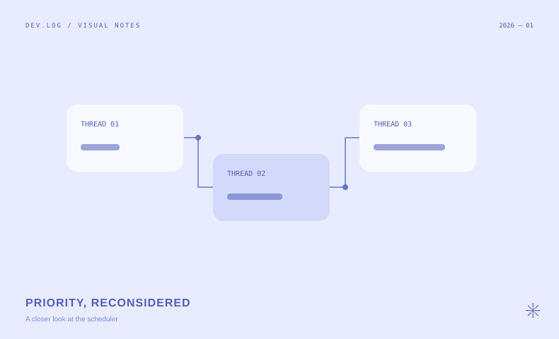

## 먼저, 우선순위 역전이라는 문제

높은 우선순위의 스레드가 낮은 우선순위 스레드가 가진 락을 기다린다고 가정해 봅시다. 그 사이 중간 우선순위의 스레드가 실행되면, 높은 우선순위의 작업도 함께 지연될 수 있습니다.

이 글은 문제를 작은 실행 순서로 나누어 살펴보기 위한 학습 노트 예시입니다.

## 기다림의 관계를 그려보기



<Caption>락 소유 관계를 따라 우선순위가 전달되는 상황을 도식화한 예시입니다.</Caption>

### 원래 값과 유효 값

스레드 자신의 우선순위와 다른 스레드로부터 전달받은 우선순위를 구분하면, 락을 놓았을 때 무엇을 복원해야 하는지 생각하기 쉬워집니다.

```c title="priority-example.c"
/* Conceptual example, not a full Pintos implementation. */
int effective_priority(int base, int donated) {
    return base > donated ? base : donated;
}
```

<Callout>실제 구현에서는 여러 락과 여러 기부자가 동시에 존재하는 경우까지 고려해야 합니다.</Callout>

## 중첩된 관계에서는

A가 B의 락을 기다리고 B도 C의 락을 기다린다면, 한 단계의 비교만으로는 충분하지 않습니다. 누가 누구를 기다리는지 관계를 따라가며 상태를 확인해야 합니다.

| 확인할 상황 | 생각해볼 질문 |
| --- | --- |
| 여러 기부자 | 가장 높은 우선순위는 무엇인가? |
| 락 해제 | 어떤 기부 관계가 끝났는가? |
| 중첩된 대기 | 어느 스레드까지 전달되는가? |

## 기록해둘 질문

- 락을 놓은 직후에도 남아 있는 기부가 있는가?
- 대기열의 정렬은 언제 갱신되는가?
- 현재 실행 중인 스레드의 양보 시점은 언제인가?

> 동작을 설명할 수 있는 작은 예제를 먼저 만들고, 그 다음 코드를 읽어봅니다.
