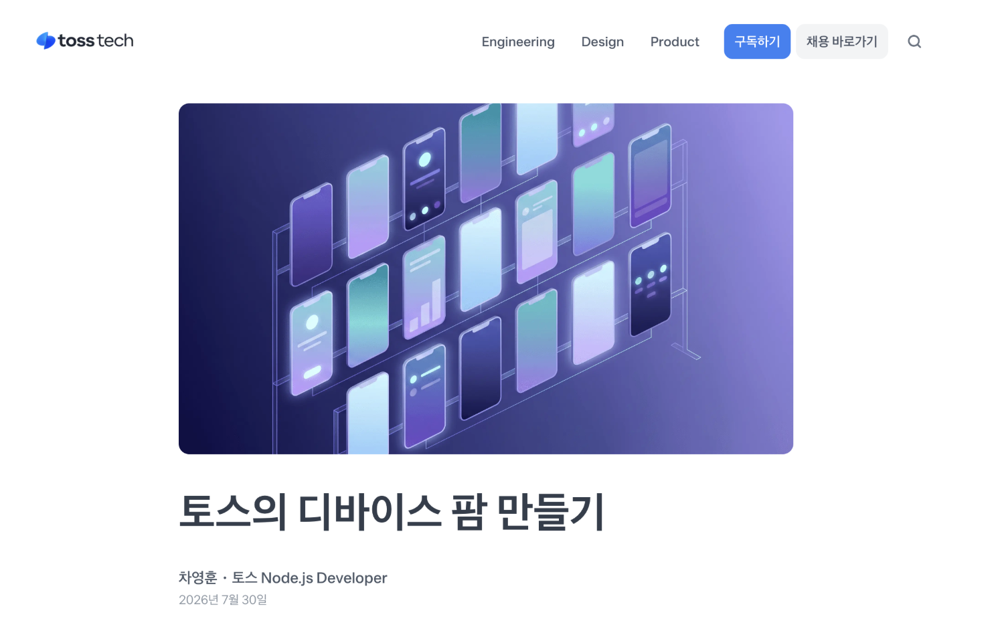
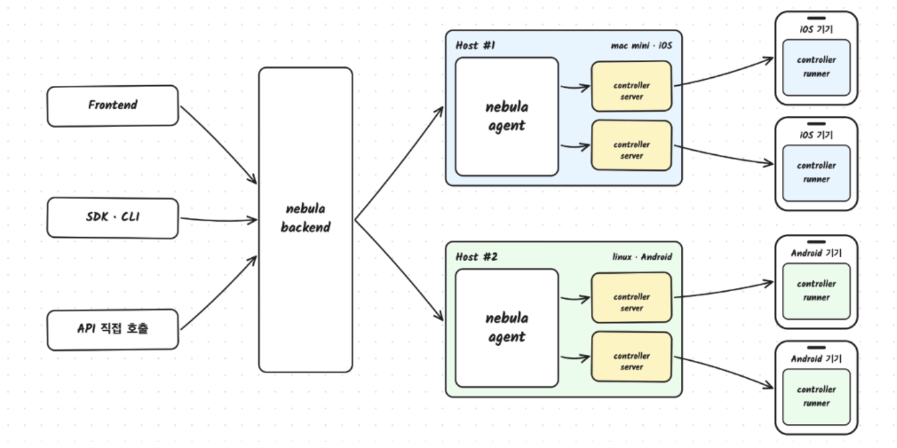
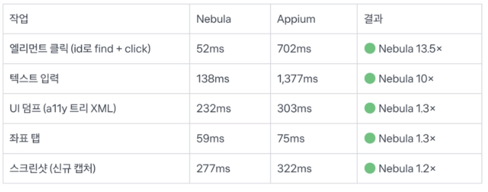

원본 글: [https://toss.tech/article/device-farm-nebula](https://toss.tech/article/device-farm-nebula)

팀마다 각자 폰을 꽂고 자신이 만든 무언가의 테스트를 돌려야 하고, 이때 각 팀마다 진입 장벽, 기기 관리, 반복되는 삽질, 규모, 격리 자원, 보안, 정책 유지 등의 문제가 발생함. 토스는 이걸 네뷸라라는 디바이스 팜으로 풀었고, 그 글을 읽고 정리한 리뷰.

- Client / Server / Agent / 기기 4계층으로 나눠 API 호출 한 번에 실 기기를 잡고 돌려줌
- Appium을 버리고 자체 드라이버를 만듦 — 클릭 속도 10배, 세션 대신 stateless HTTP
- 실시간 미러링은 Android(scrcpy 걷어내고 내재화), iOS(USB 비독점 캡처) 둘 다 자체 구현

## 문제 상황: 팀마다 각자 폰을 꽂고 테스트를 돌려야 함

- 팀마다 각자 폰을 꽂고 자신이 만든 무언가의 테스트를 돌려야 함
- 이때 각 팀마다 진입 장벽, 기기 관리, 반복되는 삽질, 규모, 격리 자원, 보안, 정책 유지 등의 문제가 발생함

### 맥미니 5대 15기기에서 수백 대로

- 초기: 맥미니 5대에 기기 15대, 개발자 1명
- 현재: 팀원 합류, 수백 대를 향해 늘고 있음

## 조건: 누구든, 어디서든, API 호출 한 번으로 실 기기를 제어

> 누구든, 어디서든, API 호출 한 번으로 실 기기를 제어

이게 근데 사용자 입장에선 딸깍 딸깍의 느낌이 있겠지만 사실 정말 어려운 게 각자 다른 OS 사용하고 (안드로이드, iOS), 실시간 반응 또한 가능해야하고 과연 어떻게 풀었을까 궁금증이 생겼다.

## 아키텍처: Client → Server → Agent → 기기

### Client: 네뷸라를 부르는 다양한 입구

- 네뷸라는 API를 호출하는 여러 클라이언트로 열려 있음
- 화면을 보며 직접 조작하는 Front
- 테스트 코드를 불러쓰는 SDK CLI
- 저수준으로 붙는 API 직접 호출

### Server: 전체를 총괄하는 오케스트레이션 계층

- 기기 발견 - 점유 - 테스트 실행 관리
- 테스트 실행 요청 -> 카프카 -> 러너가 나눠서 소비
- 한 기기에 두 테스트가 동시에 붙어 서로 간섭하는 일을 막기 위해
    - occupy - assign - release로 기기에 분산 락을 걸어줌

### Agent: 기기가 물린 호스트에서 도는 다리

- 기기가 실제로 연결된 호스트에서 돌면서 로컬 기기 관리를 함
- ADB, Xcode로 연결된 기기를 자동으로 발견, 서버의 요청을 각 기기의 컨트롤러로 전달

### 기기: 가장 하위 계층

기기마다 **Controller Server**가 하나씩 떠서 그 기기로 가는 요청을 받고 이후

### Controller 작동 정리

- 네뷸라 호출 시
    - 테스트 실행 요청이 들어옴
    - Server가 요청을 받음
    - Server가 Kafka에 실행 메시지를 넣음
    - Runner 인스턴스 여러 대가 해당 토픽을 나눠서 소비함
    - Runner가 occupy로 조건에 맞는 기기를 잡음
    - Server가 분산 락을 걸어줌
    - 확정된 기기가 물려 있는 호스트의 Agent에게 요청이 감
    - 요청을 기기의 Controller Server로 넘겨짐
    - Controller server -> controller runner
    -> 이 부분이 세션 리스, stateless HTTP 호출 나감, Appium이었으면 이 앞에서 세션 구축이 들어감
    - 실행 결과는 역순으로 올라오고, 테스트가 끝나면 release로 락이 풀려 기기가 다시 풀에 돌아감

> **예상)** 만약 실시간 동작(미러링)을 한다면 아마 Release를 풀어주지 않고 완전한 동작 단위를 종료 버튼이라던지 다른 이벤트 구독 같은 느낌으로 가지 않을까

## Appium을 버리고 nebula driver를 선택한 이유

### 가장 자주 쓰는 클릭에서 속도 차이가 10배 넘게 남

- 가장 자주 쓰는 클릭에서 속도 차이가 10배 넘게 남
- 이유는 Appium이 견고성 때문에 매 동작 이전 화면 안정까지 기다리는 waitForldle 시간이 있음. -> 이 설정을 끄게 되면 2~3배 정도 좁혀진다 말함
- 토스의 경우 서버실의 기기를 실시간 조작 목표가 있었기 때문에 견고성 < 속도 우선 시 되었음

### Appium은 세션 기반이라 시작이 느리고 자주 실패함

- 시작이 느림, 명렁 이전에 세션을 세우고, 세션이 켜지는 데 시간이 걸림
- 자주 실패 - 규모가 커질 수록
- 관리가 까다로움 - 많아질수록

### 네뷸라는 컨트롤러를 상시 띄우고 stateless HTTP를 던짐

- 시작 비용, 세션 실패 모두 없어짐
- 기기 컨트롤러 -> 상시 (Pre-warm)
- 그 위에 Stateless http 요청을 던짐

### 토스 커스텀

- 자체 IME
- 커스턴 신호 트리거
- 앱 센터 연동
- 보안 정책 적용

등의 커스텀 작동 가능

## 컨트롤러를 기기 계층부터 다시 만듬

- Android -> ADB, UiAutomation
- iOX -> Swifth XCTest
- 인터페이스는 OpenAPI 스펙 하나로 정의
    - Go와 TS 코드를 생성

## 진짜 어려웠던 실시간 문제

> 테스트를 만드는 사람이 기기 화면을 실시간으로 보면서 동시에 조작해야 함

- 실시간 조작과 화면 미러링이 동시에 돌아야 함
- Android, iOS 2가지 운영체제에서 동시에 수행 되어야 함
- 일반적인 테스트 자동화 -> 정해진 동작 수행
- 네뷸라 -> 실시간 요구

### Android 미러링: scrcpy를 걷어내고 인코딩 방식만 참고해 내재화

- scrcpy는 안드로이드 화면 -> 데스크톱 앱이 전제 조건이라, 서버를 거쳐 브라우저로 여러 명에게 뿌리는 구조에 안맞음
- 자체 클라이언트와 프로토콜이 필요
- 인코딩 방식만 참고하여 내제화
    - SurfaceControl로 가상 디스플레이 -> MediaCodec으로 H.264영상으로 인코딩 (솔직히 이 부분은 무슨 말인지 잘 모르겠음 -> 정말 추상적으로만 이해 됨)
- 이것을 브로드캐스터로 보내면 브라우저 시청자 여러 명에게 동시에 뿌릴 수 있음

### iOS 미러링: USB를 통으로 잡지 않으니 공존 가능해짐

- QuickTime Player가 iOS화면에서 가져올 때 쓰는 것과 같은 캡처 장치를, USB를 독점하지 않는 경로로 활용하는 방식을 자체적으로 내제화
- USB를 통으로 잡지 않으니 공존 가능해짐
- 기존 방식들은 동시 라는 조작 요구에 부딪힘

## 현재 가능한 기능

- 웹 페이지: 브라우저에서 기기 콘솔을 열어 미러링을 보며 클릭 만으로 테스트 스텝 만듬
- SDK: 개발자에게 SDK 형태로 제공하여 E2E 테스트 코드 작성
- CLI: 터미널 / CI,CD에서 실행, 로컬 AI 에이전트 CLI를 통하여 실기기 조작 가능
- 로그 검수 시스템
- AI 에이전트: API 위에 AI 에이전트를 얹어 테스트 진행
- 직접 API 호출

## 다음 목표: 기기를 넘어 테스트 조건을 provision 하기

- 더 쉽게 테스트를 만들게 하기
- 더 많은 팀이 쓸 수 있도록 진입 장벽 낮추기
- 기기를 넘어 테스트를 빠르게 구축하는 환경 제공

## 기술 블로그 리뷰 회고

- 일단 문제점 정의가 직관적이라 좋았다는 생각이 든다. 많은 팀에서 자신이 메인으로 해결해야 하는 문제가 아닌 환경 / 테스트 관련하여 부가적인 고통과 노력이 든다는 점
- 각 기술을 선택하는 상황에서 CS적인 판단이 상시로 들어가고 병목 지점과 해자 지점이 명확하게 표현된 것이 너무 좋았고 나도 저렇게 판단할 수 있는 개발자가 되고 싶다는 생각이 들었다.
- 확장의 가능성이 너무 명확하게 보이고 실제 다음 목표로 잡은 것 또한 네뷸라 라는 서비스에서 제공할 수 있는 가치와 매우 잘 맞는다고 생각한다. 확장에서도 실제 테스트를 만드는 과정에서 공유하게 되거나 미리 설정되어도 되는 가정 자체의 책임을 가져오려는 방향 자체가 너무 매력적으로 느껴진다.
- 너무 멋진 개발자이신 것 같다는 생각이 든다. 실제 존재하는 오픈소스에 내에서 필요한 부분을 가져다가 사용하고, 기존의 방식에서 우리 서비스의 요구 사항을 충족하지 못한다면 과감하게 버리고 새로운 구조를 만들고 정말 활용도 높고 매력적인 지식인 것처럼 느껴진다.
