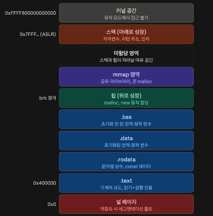
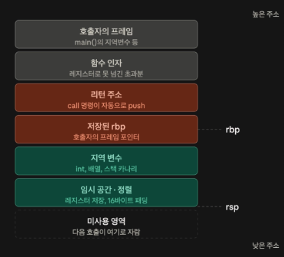
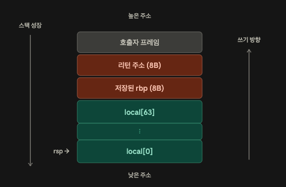
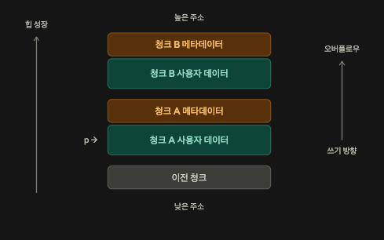

## 버퍼 오버플로우에 대해서 알아보자

우리는 속도가 다른 두 공간 사이, 이 문제를 해결하기 위해 `Buffer`라는 것을 사용한다.

- 생산자와 소비자가 서로의 속도에 맞춰 기다리지 않아도 되게 만드는 것이 목표다.

보통 `Java`, `Python` 등은 배열이 자기 길이를 정해진 객체로 런타임에 들고 다니고, 그래서 자연스럽게 접근이 제한된다.

예를 들어

```python
arr = [0 for _ in range(n)]
arr[n+100]  # 접근이 불가능하다.
```

하지만

```c
char buf[8];
buf[100] = 'A';
```

라고 해도 실행이 된다.

`buf[100]`은 컴파일러 입장에서 그냥 `*(buf + 100)`이다. 여기서 크기가 8이라는 정보는 컴파일 시점에만 존재하고, 런타임에는 시작 주소만 던진다.

또한 `C`, `C++`은 포인터 주소 조작을 언어 차원에서 막지 않고, `strcpy`, `gets`, `sprintf` 등은 버퍼 크기를 인자로 받지 않는다.

그러면 이게 왜 문제가 되는지를 가상 메모리 기준으로 확인해보면



`Python`, `Java`는 객체로서 보통 힙으로 간다. 그럼 `C`에서는 어디로 갈까?

`malloc`/`new`로 쓰면 해당 데이터는 힙에 생성된다. 그리고 스택에는 이 주소를 담은 포인터 변수 8바이트만 남는다. 하지만 `char local[64]`처럼 선언할 경우 이는 스택에 저장된다.

## 스택 메모리에서의 오버플로우

그러면 여기서 스택 메모리를 조금 더 보면



이런 형태를 보인다.



여기서 보면 배열의 선언은 아래로 일어난다. `64`만큼의 공간을 배열이 차지하게 되고 위로 쓰기가 일어난다. 배열의 방향도 0~63이 위와 같이 일어나게 된다.

그러면 앞서 말한 상황과 같이 배열 밖의 값 호출은 필연적으로 다른 곳들을 건드리게 된다.

여기서 배열의 값을 `우연치 않게(?)` 리턴 주소가 있는 위치까지 침범하게 되면, 나중에 `PC(Program Counter)`가 저 부분을 읽고 무언가를 실행할 수도 있다.

## 힙에서의 오버플로우



여기서 `이전 청크`라는 곳이 있다. 저 부분에 메타데이터가 있다. 청크의 크기, 이전 청크가 사용 중인지 여부, 청크가 `free`일 때 다음·이전 `free` 청크를 가리키는 포인터 같은 게 들어간다. 사용자는 이를 못 느끼지만 `free`와 `malloc`은 이 부분을 읽고 진행한다.

그러면 당연하게도 다음 `malloc`으로 저장된 객체가 사용자 데이터를 넘어서 쓰게 되면, 바로 위 청크의 사용자 데이터를 덮어쓰게 된다.

그러면 문제는 바로 터지는 게 아니라 **B를 free하거나 할당할 때** `malloc`이 해당 메타데이터를 엉뚱하게 읽고 작동하게 된다. 그렇기 때문에 흔히 말하는 예상치 못한 동작을 하는 순간을 잡기 어렵게 만든다.

## 요약

- 가상 메모리 어디서든 버퍼 오버플로우가 일어날 수 있다.
- 스택 / 힙 모두에서 일어나는 것이 가능하다.
