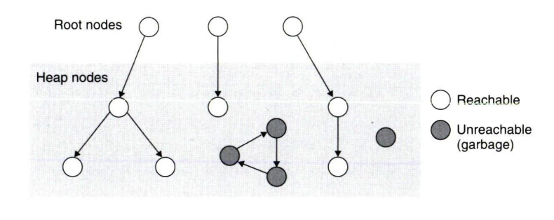
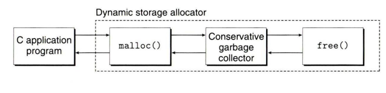
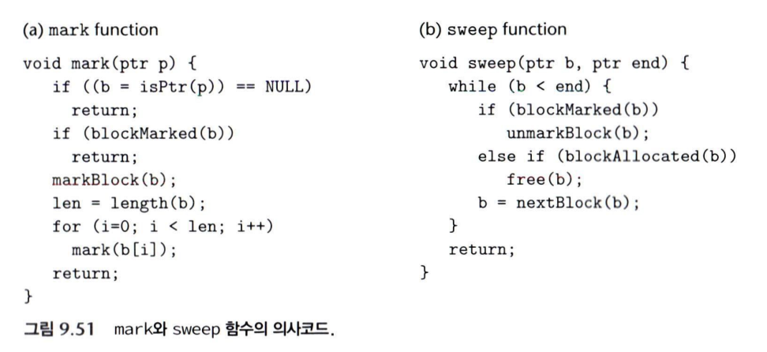
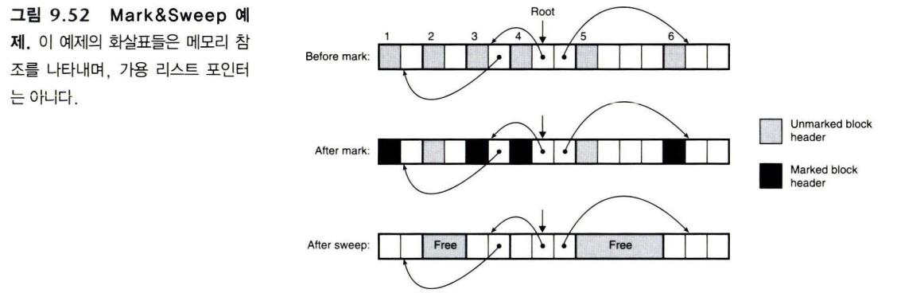
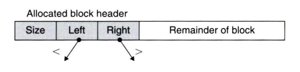

동적 메모리를 직접 관리하는 C 프로그램에서는 할당받은 블록을 적절한 시점에 `free`하는 것이 프로그램의 책임이다. 그런데 그 주소를 잃어버리면 어떻게 될까?

```c
void garbage(void)
{
    int *p = (int *)Malloc(15213);
    return;
}
```

대문자 `Malloc`은 책에서 사용하는 할당 래퍼다. 이 함수에서 사라지는 것은 지역 포인터 변수 `p`다. **힙에 할당한 블록은 함수가 끝났다고 자동으로 반환되지 않는다.** 다른 곳에 주소를 저장하지 않았다면 더는 그 블록에 접근할 수 없게 된다.

CSAPP 9.10은 이런 블록을 자동으로 찾아 회수하는 가비지 컬렉션을 다룬다. 9.10.1의 기초, 9.10.2의 Mark & Sweep, 9.10.3의 보수적 수집을 한 흐름으로 묶었다.

## 가비지 컬렉션이 대신 맡는 일

**가비지 컬렉터(garbage collector)** 는 더 이상 필요하지 않은 힙 블록을 식별해 재사용 가능한 공간으로 돌려준다. 자동으로 이 회수를 수행하는 과정이 가비지 컬렉션이다.

책의 모델에서 응용 프로그램은 블록을 요청하지만, 반환 시점을 일일이 지정하지 않는다. 컬렉터와 통합된 할당기가 필요할 때 도달 불가능한 블록을 찾아 가용 리스트로 돌려준다.

일반 C의 `malloc`에 이런 기능이 기본으로 붙어 있는 것은 아니다. 아래 내용은 **GC와 통합된 할당기**를 가정한다.

## 9.10.1: 메모리를 방향 그래프로 보기



<Caption>CSAPP 그림 9.49. 서로 참조하는 순환 구조도 루트에서 닿지 않으면 도달 불가능하다.</Caption>

메모리를 그래프로 보면 “어떤 블록을 회수할 수 있는가?”라는 질문을 탐색 문제로 바꿀 수 있다.

| 요소 | 메모리에서의 의미 |
| --- | --- |
| 힙 노드 | 힙에 할당된 블록 |
| 루트 | 레지스터, 스택, 전역 영역 등에서 보존해야 할 참조 |
| 간선 `p → q` | 블록 p 안에 블록 q를 가리키는 포인터가 있음 |

루트에서 포인터를 따라 도달할 수 있으면 **reachable**, 어느 루트에서도 닿을 수 없으면 **unreachable**이다.

컬렉터가 사용하는 메모리 모델의 전제 아래에서는, 도달 불가능한 블록은 프로그램이 다시 접근할 경로가 없으므로 회수할 수 있다. 반면 도달 가능하다고 앞으로 반드시 사용하는 것은 아니다. 컬렉터는 프로그램의 미래 의도를 알 수 없어 일단 유지한다.

그래프 가운데 서로 참조하는 블록들도 루트와 연결되어 있지 않으면 가비지가 될 수 있다. 다른 블록이 참조한다는 사실만으로 생존을 판단하지 않는다는 점이 중요하다.

### C에서 포인터인지 확신할 수 없다면

보수적 컬렉터는 메모리를 훑을 때 어떤 비트 패턴이 진짜 포인터인지 확신하기 어려울 수 있다. 예를 들어 어떤 환경에서 큰 정숫값이 우연히 힙 주소와 같아질 수 있다.

```c
long x = 0x7f0012345678;
```

포인터일 가능성이 있다면 해당 블록을 유지한다. 이 때문에 **보수적(conservative)** 이라고 부른다. 필요 없는 블록이 살아남는 오탐을 허용해, 실제로 사용하는 블록을 잘못 반환하는 일을 피하려는 것이다.

다만 이 안전성은 루트를 올바르게 수집하고 실제 포인터 표현을 인식할 수 있다는 전제에 달려 있다. 포인터를 임의로 인코딩하거나 컬렉터가 모르는 곳에 숨기는 프로그램까지 무조건 안전하다는 의미는 아니다.

### 할당기와 컬렉터를 연결하는 흐름



<Caption>CSAPP 그림 9.50. 회수된 블록은 다시 할당기의 가용 공간이 된다.</Caption>

책의 단순한 흐름은 다음과 같다.

1. 프로그램이 `malloc`으로 블록을 요청한다.
2. 할당기는 적합한 가용 블록을 찾는다.
3. 없으면 컬렉터를 호출해 회수할 수 있는 블록을 반환한다.
4. 회수된 공간에서 다시 할당을 시도한다.
5. 여전히 부족하면 힙 확장을 시도한다.
6. 끝내 공간을 얻지 못하면 할당 실패를 반환한다.

컬렉터의 실행 방식은 구현에 따라 다르다. 별도 스레드에서 동작하는 방식도 있지만, 변경 중인 포인터 그래프를 안전하게 다루려면 추가적인 동기화와 추적 장치가 필요하다. 여기서는 그래프를 안정적으로 관찰할 수 있는 기본 모델에 집중한다.

## 9.10.2: Mark & Sweep

**Mark & Sweep** 은 도달 가능한 블록을 표시한 뒤, 표시되지 않은 할당 블록을 회수하는 두 단계로 구성된다.



<Caption>CSAPP 그림 9.51. 실제 C 프로그램이 아니라 수집 과정을 설명하는 의사 코드다.</Caption>

블록 헤더의 남는 비트 하나를 mark 여부에 사용할 수 있다. 아래 함수들은 책의 모델에서 제공하는 연산이다.

| 함수 | 하는 일 |
| --- | --- |
| `isPtr(p)` | p가 할당된 블록 내부를 가리키면 그 블록의 시작을 반환, 아니면 NULL |
| `blockMarked(b)` | 이미 표시한 블록인지 확인 |
| `blockAllocated(b)` | 할당 상태인지 확인 |
| `markBlock(b)` | mark 표시 |
| `unmarkBlock(b)` | mark 표시 제거 |
| `length(b)` | 검사할 데이터 영역의 워드 수 |
| `nextBlock(b)` | 힙에서 다음 블록 찾기 |

### Mark: 루트에서 시작해 도달 가능한 블록을 표시한다

원문의 재귀 흐름을 변수 선언 등의 세부 구현을 생략한 의사 코드로 쓰면 다음과 같다.

```text
mark(p):
    b = isPtr(p)
    b가 없으면 종료
    b가 이미 표시되어 있으면 종료

    b를 표시
    b의 데이터 영역에 있는 각 워드에 대해:
        그 값을 포인터 후보로 보고 mark를 호출
```

이 작업을 각 루트에서 시작한다. 블록 안에 다른 블록을 가리키는 값이 있으면 그 블록으로 들어가므로 깊이 우선 탐색처럼 동작한다.

여기서 **이미 표시했는지 검사하는 순서**가 중요하다. 서로 가리키는 블록들이 있을 때 방문 표시 없이 재귀하면 같은 블록을 계속 탐색할 수 있다. 하위 블록으로 내려가기 전에 먼저 표시해야 한다.

### Sweep: 표시되지 않은 할당 블록을 반환한다

Mark는 포인터 그래프를 따라가지만, Sweep은 힙의 블록들을 순회한다.

```text
힙의 각 블록 b에 대해:
    b가 표시되어 있으면:
        표시를 지움
    그렇지 않고 b가 할당 상태이면:
        b를 가용 공간으로 반환
    그렇지 않으면:
        이미 가용 블록이므로 그대로 둠
```

| 블록 상태 | Sweep에서 하는 일 |
| --- | --- |
| 표시됨 | 유지하고 다음 GC를 위해 표시만 지움 |
| 표시되지 않음 + 할당됨 | 가비지로 판단해 반환 |
| 표시되지 않음 + 가용 | 이미 빈 공간이므로 중복 반환하지 않음 |

이것을 실제 할당기에 구현할 때는 반환 도중 블록 연결로 순회 위치가 바뀌는 문제도 고려해야 한다. 책의 의사 코드에서 `free`와 `nextBlock`은 그 세부 구현을 추상화한 연산이다.



<Caption>CSAPP 그림 9.52. 화살표는 프로그램의 메모리 참조이며 가용 리스트 연결 포인터가 아니다.</Caption>

## 9.10.3: C에서의 보수적 Mark & Sweep

Mark & Sweep은 살아 있는 블록을 다른 주소로 옮기지 않는다. 보수적으로 포인터를 찾는 C 환경에서 이 점은 중요하다. 어떤 값이 진짜 포인터인지 확신할 수 없다면, 블록을 이동한 뒤 모든 참조를 정확히 고치는 일도 어렵기 때문이다.

여기서 `isPtr`에는 서로 다른 두 문제가 있다.

| 문제 | 대응 |
| --- | --- |
| 이 값이 실제 포인터인가? | 비트 패턴만으로 확정하기 어려우므로 후보를 보수적으로 취급 |
| 블록 중간을 가리킨다면 블록 시작은 어디인가? | 할당 블록의 주소 범위를 검색하는 자료구조 사용 |

### 균형 트리로 블록의 범위를 찾기



<Caption>CSAPP 그림 9.53. 주소로 정렬한 할당 블록들을 균형 트리로 관리하는 모델.</Caption>

할당된 블록들을 시작 주소 기준의 균형 트리로 관리하면, 후보 주소가 어느 블록 안에 들어가는지 검색할 수 있다.

블록의 시작 주소와 크기를 비교해 범위에 속하는지 확인하고, 아니면 주소가 작거나 큰 방향으로 내려간다. 할당 블록이 n개라면 균형을 유지하는 트리에서 이 검색은 `O(log n)`에 가능하다.

이 트리는 **주어진 주소가 어느 블록에 속하는지**를 알아내는 문제를 해결한다. **그 값이 진짜 포인터인지**를 알아내는 것은 아니다. 주소와 우연히 일치한 정숫값 때문에 불필요한 블록이 유지될 가능성은 남는다.

또한 비이동 방식은 살아 있는 블록을 한쪽으로 모으는 압축을 하지 않는다. 따라서 가용 공간이 흩어질 수 있고, 경계 태그 연결 같은 할당기의 공간 관리 정책도 여전히 의미가 있다.

## 도달 가능성, 표시, 회수를 구분하기

이번 절의 흐름은 그래프로 도달 가능성을 판단하고, Mark로 그 결과를 기록한 다음, Sweep으로 가용 공간을 되돌리는 과정이다. 보수적 수집은 여기에 “포인터일지도 모르는 값도 일단 유지한다”는 판단을 더한다.

회수할 수 있는 블록을 찾는 문제와, 회수한 공간을 다음 요청에 잘 배분하는 문제는 연결되어 있다. 앞서 살펴본 가용 리스트와 GC가 별개의 기능처럼 보여도 결국 같은 힙을 관리한다는 점에서 만난다.

---

## 함께 읽기

- [CSAPP 9.9.11 - 경계 태그로 인접한 가용 블록 합치기](/blog/csapp-9-9-11-boundary-tags)
- [CSAPP 9.9.12 - 간단한 동적 메모리 할당기 구현 읽기](/blog/csapp-9-9-12-implicit-allocator)
- [CSAPP 9.9.13 - 명시적 가용 리스트와 pred·succ 포인터](/blog/csapp-9-9-13-explicit-free-list)
- [CSAPP 9.9.14 - 분리 가용 리스트와 버디 시스템](/blog/csapp-9-9-14-segregated-free-lists)
- [CSAPP 9.11 - C 프로그램에서 만나는 메모리 버그 10가지](/blog/csapp-9-11-c-memory-bugs)
