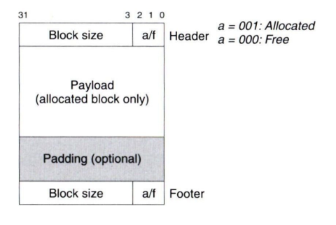
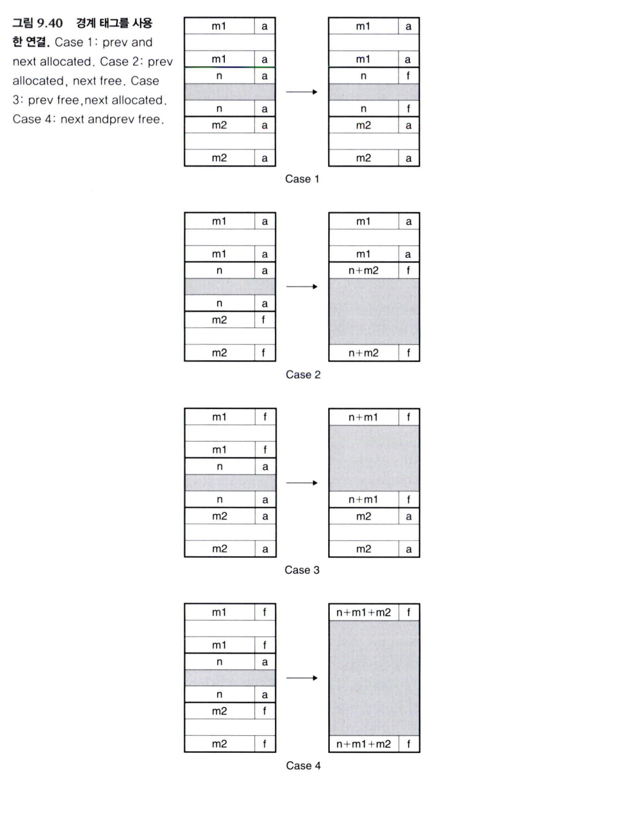

`free()`로 블록을 반환하면 그 공간을 다시 쓸 수 있다. 그런데 바로 옆에도 가용 블록이 있다면, 두 블록을 하나로 합쳐 더 큰 요청에 사용할 수 있지 않을까?

CSAPP 9.9.11은 이 **연결(coalescing)** 을 빠르게 수행하기 위해 블록의 앞뒤에 정보를 두는 방법을 설명한다. 여기서 가용 블록은 현재 할당되지 않아 다시 사용할 수 있는 메모리 블록이다.

## 헤더에는 크기와 할당 여부가 들어 있다



<Caption>Notion 학습 기록에 첨부한 CSAPP의 경계 태그 블록 구조.</Caption>

이 예제의 헤더는 4바이트, 즉 32비트다. 블록 크기는 헤더·페이로드·패딩·푸터를 모두 포함하며, 항상 8의 배수로 맞춘다.

크기가 8의 배수라면 이진수의 하위 3비트는 항상 0이다. 따라서 그중 가장 낮은 비트를 할당 여부에 사용할 수 있다.

```text
헤더 값 = 블록 크기 | 할당 비트

크기 24, 할당됨:
0x18 | 0x1 = 0x19

크기 24, 가용:
0x18 | 0x0 = 0x18
```

크기와 할당 여부를 읽을 때는 각각 마스크를 적용한다.

```c
header & ~0x7   // 하위 3비트를 지워 블록 크기만 남김
header & 0x1    // 가장 낮은 비트로 할당 여부 확인
```

이 배치에서는 나머지 두 하위 비트는 사용하지 않는다. 크기 필드 안에서 정렬 때문에 비어 있는 비트를 다른 정보에 활용하는 방식이다.

## 다음 블록은 찾기 쉽지만 이전 블록은 어렵다

“현재 블록의 헤더가 다음 블록을 가리킨다”는 말은 헤더에 실제 포인터가 있다는 뜻이 아니다. **현재 헤더의 주소에 블록 크기를 더하면 다음 헤더의 주소를 계산할 수 있다**는 뜻이다.

```text
[현재 헤더 | 페이로드 ... ][다음 헤더 | ... ]
 ↑ 현재 헤더 주소 + 크기 ───→ ↑
```

다음 블록이 가용 상태이면 두 크기를 합쳐 하나의 블록으로 만들 수 있다.

반면 헤더만 있는 구조에서는 바로 앞 블록의 시작을 알기 어렵다. 현재 헤더에는 자신의 크기만 있으므로, 앞 블록이 얼마나 긴지 역으로 계산할 정보가 없다. 힙의 처음부터 블록들을 따라가 이전 블록을 찾으면 전체 블록 수에 비례하는 시간이 든다.

## 푸터가 이전 블록의 크기를 알려준다

이 문제를 해결하기 위해 블록 끝에 헤더와 같은 정보를 한 번 더 기록한다. 이것이 **푸터(footer)** 이며, 블록 양 끝의 정보를 경계 태그라고 한다.

```text
[ 이전 블록 ... | footer ][ 현재 헤더 | 현재 블록 ... ]
                  ↑ 현재 헤더 주소 - 4바이트
```

현재 헤더 바로 앞의 4바이트를 읽으면 이전 블록의 크기와 할당 여부를 알 수 있다. 그 크기만큼 뒤로 이동하면 이전 블록의 시작에 도달한다.

따라서 앞뒤 블록을 찾기 위해 힙 전체를 탐색할 필요가 없다. 경계 태그를 사용하면 **물리적으로 인접한 가용 블록의 연결을 상수 시간에 처리할 수 있다.** 별도의 가용 리스트에 삽입하는 비용은 그 리스트의 관리 정책에 따라 달라진다.

## 반환할 때 가능한 네 가지 경우

현재 블록을 반환할 때 확인해야 하는 것은 앞뒤 블록의 할당 상태다. `A`는 할당된 블록, `F`는 가용 블록을 뜻한다.

```text
1. [A][현재][A] → [A][ F ][A]
   합칠 이웃이 없다. 현재 블록만 가용으로 표시한다.

2. [A][현재][F] → [A][   F   ]
   현재 블록과 다음 블록을 합친다.

3. [F][현재][A] → [   F   ][A]
   이전 블록과 현재 블록을 합친다.

4. [F][현재][F] → [      F      ]
   이전·현재·다음 블록을 모두 합친다.
```



<Caption>CSAPP 그림 9.40. 앞뒤가 모두 할당된 경우에는 연결할 블록이 없다.</Caption>

| 경우 | 새 헤더를 기록할 위치 | 새 푸터를 기록할 위치 |
| --- | --- | --- |
| 합칠 이웃 없음 | 현재 블록의 헤더 | 현재 블록의 푸터 |
| 현재 + 다음 | 현재 블록의 헤더 | 다음 블록의 푸터 |
| 이전 + 현재 | 이전 블록의 헤더 | 현재 블록의 푸터 |
| 이전 + 현재 + 다음 | 이전 블록의 헤더 | 다음 블록의 푸터 |

합친 덩어리의 맨 앞과 맨 뒤에 **새 전체 크기와 가용 상태**를 기록하면 된다. 중간에 남은 옛 헤더와 푸터는 이제 큰 블록 내부의 데이터일 뿐이다. 블록을 순회할 때 새 헤더의 크기로 건너뛰므로 경계 태그로 해석하지 않는다.

명시적 가용 리스트를 함께 사용한다면, 합쳐지는 옛 블록들을 리스트에서 제거하는 작업도 필요하다. 경계 태그 수정만으로 리스트 연결까지 자동 갱신되는 것은 아니다.

## 푸터의 비용과 생략할 수 있는 조건

이 구조는 블록마다 헤더 4바이트와 푸터 4바이트를 사용한다. 요청한 데이터가 작을수록 이 8바이트의 비중이 커진다.

최적화 방법 중 하나는 **할당된 블록의 푸터를 생략하는 것**이다. 할당된 이웃과는 합칠 수 없으므로 그 블록의 크기를 뒤에서 읽을 필요가 없기 때문이다.

다만 푸터를 단순히 지우기만 하면 안 된다. 현재 블록의 헤더 등에 **이전 블록이 할당되어 있는지 알려주는 비트**를 별도로 유지해야 한다. 이전 블록이 가용일 때만 그 푸터를 읽어야 사용자 데이터를 크기 정보로 잘못 해석하지 않는다.

이후 [9.9.12의 간단한 할당기](/blog/csapp-9-9-12-implicit-allocator)는 이해하기 쉬운 기본형으로, 할당된 블록에도 푸터를 두는 구조를 사용한다.

---

이 글은 Notion의 [「Jungle Recursion 강의 / CSAPP 9.9.11 ~ 9.11.10」](https://www.notion.so/3ecc1fef77fe80b8bca0c57bdee12d3e) 학습 기록을 바탕으로 정리했다.

## 함께 읽기

- [CSAPP 9.9.12 - 간단한 동적 메모리 할당기 구현 읽기](/blog/csapp-9-9-12-implicit-allocator)
- [CSAPP 9.9.13 - 명시적 가용 리스트와 pred·succ 포인터](/blog/csapp-9-9-13-explicit-free-list)
- [CSAPP 9.9.14 - 분리 가용 리스트와 버디 시스템](/blog/csapp-9-9-14-segregated-free-lists)
- [CSAPP 9.10 - 가비지 컬렉션과 보수적 Mark & Sweep](/blog/csapp-9-10-garbage-collection)
- [CSAPP 9.11 - C 프로그램에서 만나는 메모리 버그 10가지](/blog/csapp-9-11-c-memory-bugs)
