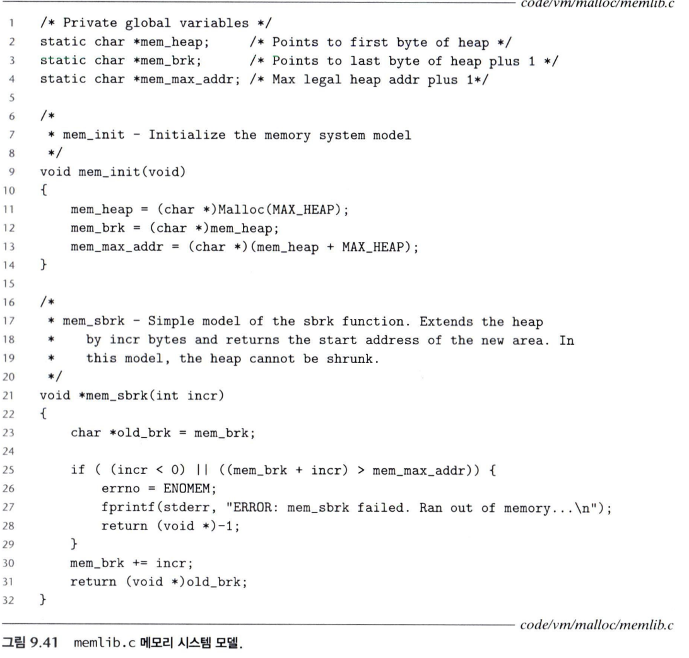
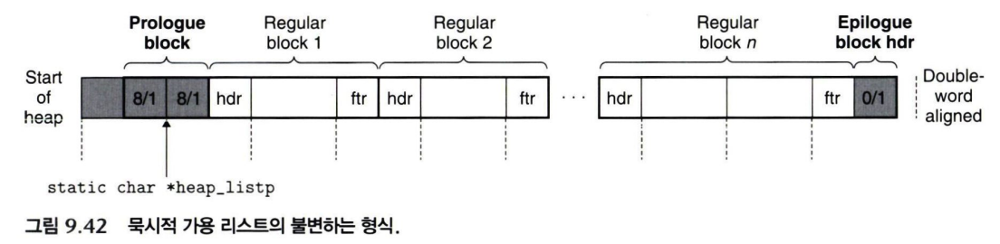
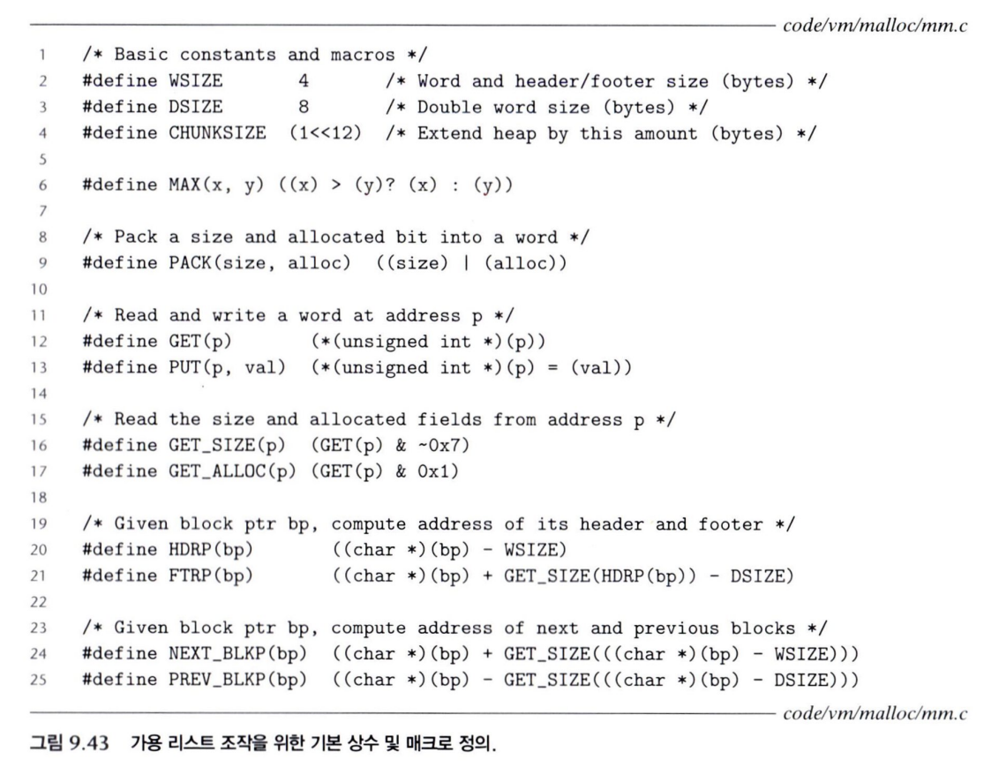
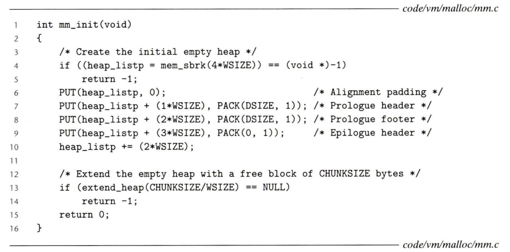
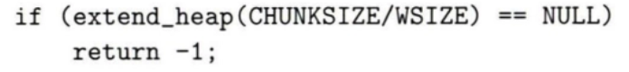
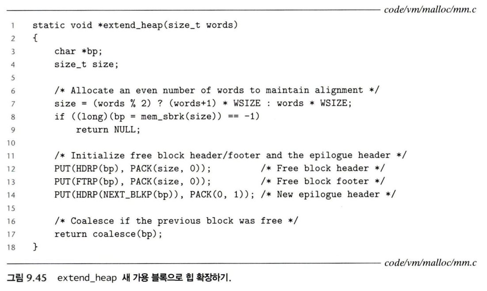
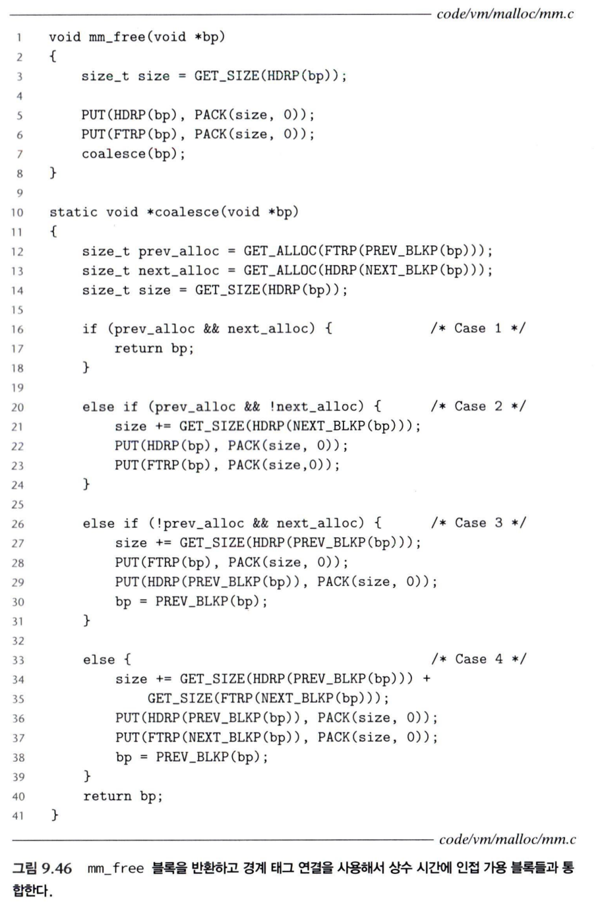
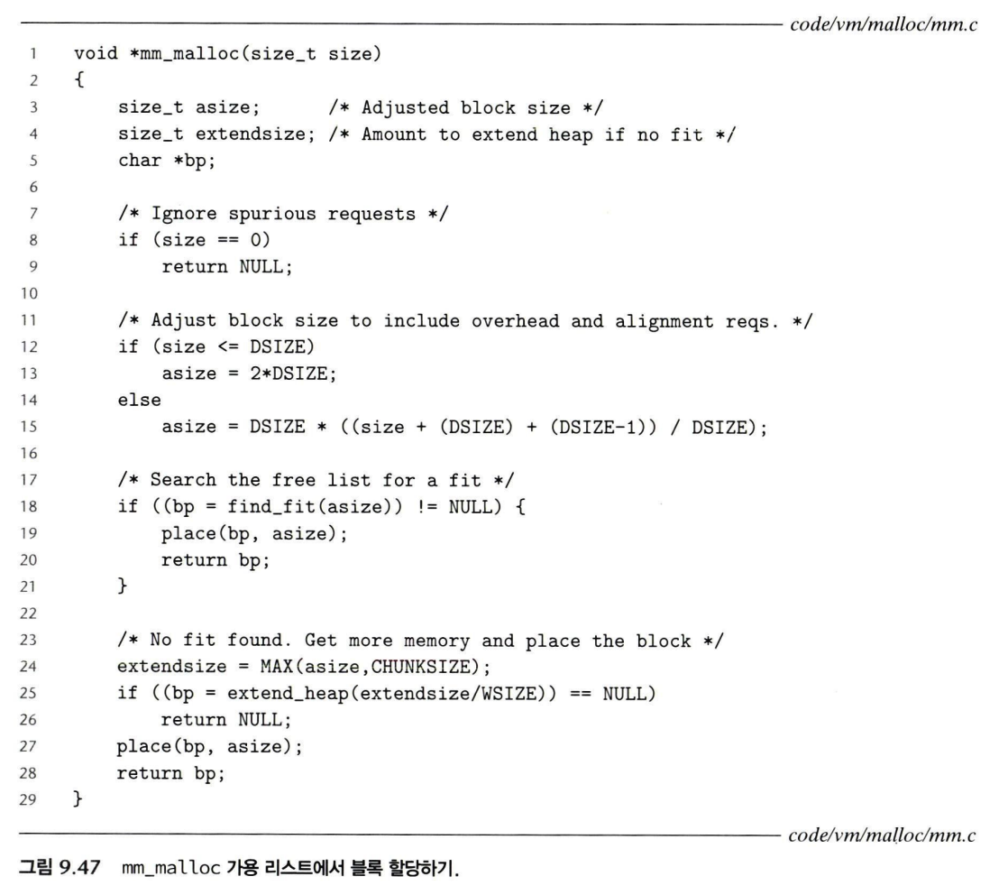

할당기는 `malloc` 요청에 맞는 가용 블록을 찾아 반환하고, `free`된 블록을 다시 관리한다. 코드의 길이보다 어려운 것은 **각 포인터가 어디를 가리키고, 그 위치의 값이 다음 계산에 어떻게 쓰이는지**를 놓치지 않는 것이다.

이 글은 CSAPP 9.9.12의 간단한 할당기를 읽은 기록이다. 묵시적 가용 리스트, first fit, 경계 태그 연결을 사용하며 헤더와 푸터는 각각 4바이트, 정렬 단위는 8바이트인 교육용 모델을 기준으로 한다. 여기서 `WSIZE`는 이 구현이 정한 크기이며 머신의 포인터 크기와 같은 뜻이 아니다.

## memlib.c: 큰 배열을 하나의 힙처럼 사용하기

이 할당기는 운영체제의 실제 힙을 직접 다루는 대신 `memlib.c`가 제공하는 메모리 시스템 모델을 사용한다. 시스템의 `malloc`과 우리가 구현하는 할당기를 구분해 실험할 수 있도록 하는 것이다.



<Caption>Notion 원문의 CSAPP 그림 9.41.</Caption>

```c
static char *mem_heap;      // 힙의 첫 바이트
static char *mem_brk;       // 현재 힙의 마지막 바이트 다음
static char *mem_max_addr;  // 준비한 전체 공간의 끝 다음
```

```text
mem_heap            mem_brk                 mem_max_addr
   ↓                   ↓                         ↓
   [  사용 중인 힙     |   아직 안 쓴 공간        ]
```

파일 범위의 `static`은 이 변수들이 해당 소스 파일 안에서만 보이도록 한다. `mm.c`에서는 변수를 직접 고치지 않고 공개된 함수를 통해 힙을 사용한다.

타입이 `char *`인 이유는 **포인터 연산을 바이트 단위로 하기 위해서**다. `char *`에 10을 더하면 10바이트 뒤를 가리킨다. `int *`라면 10개의 `int`만큼 이동하므로, `sizeof(int) == 4`인 환경에서는 40바이트 뒤가 된다.

`mem_brk`는 마지막으로 사용한 바이트가 아니라 그다음 위치다. 그래서 `mem_brk - mem_heap`이 현재 힙 크기가 되고, 둘이 같으면 크기는 0이다.

```c
mem_heap = (char *)Malloc(MAX_HEAP);
mem_brk = mem_heap;
mem_max_addr = mem_heap + MAX_HEAP;
```

여기서 대문자 `Malloc`은 시스템 `malloc`을 감싼 오류 처리용 래퍼다. 원문에서 살펴본 설정의 `MAX_HEAP`은 20MB이며, 이 값은 모델의 설정이지 모든 할당기의 고정 크기는 아니다.

### mem_sbrk는 새로 확보한 공간의 시작을 반환한다

`sbrk`는 program break를 움직이는 인터페이스다. 이 모델의 `mem_sbrk`는 그 동작을 흉내 내되, 힙을 줄이는 음수 요청은 허용하지 않는다.

원문의 동작을 표현하면 다음과 같다. 주소는 이해를 위한 가상의 숫자다.

```text
mem_init()   → mem_heap = 1000, mem_brk = 1000

mem_sbrk(16) → old_brk = 1000, mem_brk = 1016
               반환: 1000, 새로 쓸 수 있는 범위: 1000~1015

mem_sbrk(32) → old_brk = 1016, mem_brk = 1048
               반환: 1016, 새로 쓸 수 있는 범위: 1016~1047

mem_sbrk(-8) → 실패, 반환: (void *)-1
```

증가량이 음수이거나 준비한 최대 공간을 넘는 요청이면 실패한다. 성공하면 **확장 후의 끝이 아니라 확장 전의 끝**을 돌려준다. 그곳이 새로 사용할 영역의 시작이기 때문이다.

## 힙 전체의 모양과 최소 블록 크기



<Caption>CSAPP 그림 9.42. 양 끝의 특별한 블록이 경계 조건을 단순하게 만든다.</Caption>

```text
[패딩]
[프롤로그: 헤더 8/1 | 푸터 8/1]
[일반 블록: 헤더 | 페이로드 | 필요하면 패딩 | 푸터]
[일반 블록 ...]
[에필로그: 헤더 0/1]
```

`8/1`은 크기 8바이트에 할당 상태라는 뜻이다. 프롤로그는 페이로드가 없는 특별한 블록이고, 에필로그는 크기가 0인 헤더 하나다. 둘 다 할당 상태로 표시해 실제 가용 블록과 합쳐지지 않도록 한다.

일반 블록의 최소 크기는 16바이트다. 1바이트를 요청해도 헤더 4바이트와 푸터 4바이트를 더하면 9바이트이며, 이를 8의 배수로 올리면 16바이트가 된다. 특수한 프롤로그의 크기 8과 일반 블록의 최소 크기는 구분해야 한다.

## 블록 매크로: 주소와 값을 구분해서 읽기



<Caption>CSAPP 그림 9.43. 아래 설명의 bp는 페이로드 시작 주소다.</Caption>

```c
#define WSIZE      4
#define DSIZE      8
#define CHUNKSIZE  (1 << 12)
#define MAX(x, y)  ((x) > (y) ? (x) : (y))
#define PACK(size, alloc) ((size) | (alloc))
```

`CHUNKSIZE`는 4096바이트다. 공간이 부족할 때 조금씩 확장하는 대신 기본적으로 4KB씩 확보한다. 요청이 더 크면 요청에 맞춰 더 크게 확장한다.

매크로의 인자에 괄호를 붙이는 것은 `a + b` 같은 식이 들어와도 연산자 우선순위가 꼬이지 않도록 하기 위해서다. 다만 괄호가 부작용까지 없애지는 않으므로, 여러 번 평가되는 인자에 `i++` 같은 표현을 넘기지 않는 편이 좋다.

```c
#define GET(p)       (*(unsigned int *)(p))
#define PUT(p, val)  (*(unsigned int *)(p) = (val))
#define GET_SIZE(p)  (GET(p) & ~0x7)
#define GET_ALLOC(p) (GET(p) & 0x1)
```

이 모델은 `unsigned int`가 4바이트인 환경을 가정한다. `GET`과 `PUT`은 주소를 4바이트 정수 포인터로 해석한 뒤 역참조해 헤더 또는 푸터 전체를 읽고 쓴다. `char *` 그대로 역참조하면 1바이트만 읽으므로 같은 동작이 아니다.

반면 **위치를 계산할 때는 바이트 단위 이동이 필요하므로 `char *`로 바꾼다.**

```c
#define HDRP(bp) ((char *)(bp) - WSIZE)
#define FTRP(bp) ((char *)(bp) + GET_SIZE(HDRP(bp)) - DSIZE)
#define NEXT_BLKP(bp) ((char *)(bp) + GET_SIZE((char *)(bp) - WSIZE))
#define PREV_BLKP(bp) ((char *)(bp) - GET_SIZE((char *)(bp) - DSIZE))
```

| 매크로 | 계산하는 대상 |
| --- | --- |
| `HDRP(bp)` | 현재 블록의 헤더 주소 |
| `FTRP(bp)` | 현재 블록의 푸터 주소 |
| `NEXT_BLKP(bp)` | 물리적으로 다음 블록의 페이로드 시작 주소 |
| `PREV_BLKP(bp)` | 물리적으로 이전 블록의 페이로드 시작 주소 |

크기 24인 블록의 `bp`가 16이라고 가정해보자.

```text
주소: 12          16                      32        36
      [헤더 24/1][페이로드 + 패딩 16바이트][푸터    ][다음 헤더]
                  ↑ bp

HDRP(16)      = 16 - 4      = 12
FTRP(16)      = 16 + 24 - 8 = 32
NEXT_BLKP(16) = 16 + 24     = 40
```

`FTRP`에서 8을 빼는 이유는 다음 블록의 `bp`를 기준으로 다음 헤더 4바이트와 현재 푸터 4바이트를 거슬러 올라가야 하기 때문이다. `PREV_BLKP`는 `bp - 8`에 있는 이전 블록의 푸터에서 크기를 읽어 그만큼 뒤로 이동한다.

## mm_init: 프롤로그와 에필로그부터 만든다



```c
if ((heap_listp = mem_sbrk(4 * WSIZE)) == (void *)-1)
    return -1;

PUT(heap_listp, 0);
PUT(heap_listp + WSIZE, PACK(DSIZE, 1));
PUT(heap_listp + 2 * WSIZE, PACK(DSIZE, 1));
PUT(heap_listp + 3 * WSIZE, PACK(0, 1));
heap_listp += 2 * WSIZE;
```

처음에는 16바이트를 확보한다. 실제 주소가 아니라 힙 시작으로부터의 오프셋으로 그리면 다음과 같다.

```text
오프셋: 0       4                  8                  12
        [패딩][프롤로그 헤더 8/1][프롤로그 푸터 8/1][에필로그 0/1]
                                   ↑ heap_listp
```

프롤로그에는 페이로드가 없지만, `heap_listp`를 일반 블록의 `bp`에 해당하는 위치에 둔다. 이 위치는 곧 프롤로그 푸터의 시작이다. 그러면 같은 `NEXT_BLKP` 매크로를 사용할 수 있다.



이후 `extend_heap(CHUNKSIZE / WSIZE)`로 첫 가용 블록을 만든다. `extend_heap`은 바이트가 아니라 **워드 수**를 받기 때문에 4096을 4로 나눠 전달한다. `mm_init`은 성공하면 0, 실패하면 -1을 반환한다.

## extend_heap: 옛 에필로그가 새 블록의 헤더가 된다



먼저 워드 수를 짝수로 올려 8바이트 정렬을 유지한다.

```c
size = (words % 2) ? (words + 1) * WSIZE : words * WSIZE;
```

`mem_sbrk(size)`가 돌려준 옛 힙 끝을 새 블록의 `bp`로 사용한다. 그 4바이트 앞에 있던 옛 에필로그를 새 가용 블록의 헤더로 덮어쓴다.

```c
PUT(HDRP(bp), PACK(size, 0));
PUT(FTRP(bp), PACK(size, 0));
PUT(HDRP(NEXT_BLKP(bp)), PACK(0, 1));
return coalesce(bp);
```

**헤더에 크기를 먼저 쓰는 순서가 중요하다.** `FTRP`와 `NEXT_BLKP`가 그 크기를 읽어 위치를 계산하기 때문이다.

끝에는 새 에필로그를 세우고, 직전 블록이 가용 상태이면 `coalesce`로 합친다. 8바이트 정렬에 맞는 예를 들면 다음과 같다.

```text
확장 전: [가용 104][에필로그]
확장 후: [가용 104][새 가용 4096][새 에필로그]
연결 후: [        가용 4200        ][에필로그]
```

`mem_sbrk`의 실패 표시는 `(void *)-1`이고, `extend_heap`은 이를 확인해 `NULL`로 바꿔 반환한다. 두 함수의 실패 반환값을 혼동하지 않아야 한다.

## mm_free와 coalesce: 가용으로 표시한 뒤 합친다



```c
size_t size = GET_SIZE(HDRP(bp));
PUT(HDRP(bp), PACK(size, 0));
PUT(FTRP(bp), PACK(size, 0));
coalesce(bp);
```

`mm_free`는 블록의 크기를 유지하면서 헤더와 푸터의 할당 비트를 0으로 바꾼다. 이후 `coalesce`가 앞뒤 상태에 따라 연결한다.

| 이전 블록 | 다음 블록 | 결과와 반환할 bp |
| --- | --- | --- |
| 할당 | 할당 | 현재 블록 그대로 |
| 할당 | 가용 | 현재 + 다음, 현재 bp |
| 가용 | 할당 | 이전 + 현재, 이전 bp |
| 가용 | 가용 | 이전 + 현재 + 다음, 이전 bp |

이전 블록의 상태는 푸터, 다음 블록의 상태는 헤더에서 읽는다. 자세한 경계 태그 원리는 [9.9.11](/blog/csapp-9-9-11-boundary-tags)에 정리했다.

### 현재 블록과 다음 블록을 합칠 때

```c
size += GET_SIZE(HDRP(NEXT_BLKP(bp)));
PUT(HDRP(bp), PACK(size, 0));
PUT(FTRP(bp), PACK(size, 0));
```

헤더에 합친 크기를 먼저 기록했기 때문에 마지막 `FTRP(bp)`는 원래 현재 블록의 푸터가 아니라 **합친 블록의 끝**, 즉 원래 다음 블록의 푸터를 가리킨다.

### 이전 블록과 현재 블록을 합칠 때

```c
size += GET_SIZE(HDRP(PREV_BLKP(bp)));
PUT(FTRP(bp), PACK(size, 0));
PUT(HDRP(PREV_BLKP(bp)), PACK(size, 0));
bp = PREV_BLKP(bp);
```

이 경우 현재 블록의 헤더는 아직 바꾸지 않았으므로 `FTRP(bp)`는 현재 블록의 기존 푸터를 찾는다. 그곳은 합친 블록의 마지막이기도 하다.

```text
합치기 전: [A 가용 16][B 방금 반환 24][C 할당]
            bp=16      bp=32

합친 후:   [       A+B 40        ][C 할당]
            bp=16
```

앞뒤를 모두 합칠 때는 이전 블록의 헤더와 다음 블록의 푸터에 전체 크기를 기록하고, 이전 블록의 `bp`를 반환한다.

## mm_malloc: 요청 크기를 실제 블록 크기로 바꾸기



사용자가 요청하는 `size`는 페이로드 크기다. 할당기는 메타데이터와 정렬까지 포함한 **보정 크기 `asize`** 를 계산해야 한다.

이 예제는 크기 0 요청에 `NULL`을 반환한다. 8바이트 이하 요청에는 최소 블록 크기인 16바이트를 사용한다. 더 큰 요청의 계산은 다음과 같다.

```c
asize = DSIZE * ((size + DSIZE + (DSIZE - 1)) / DSIZE);
```

헤더와 푸터의 합인 8바이트를 더하고, 다시 8의 배수로 올리는 식이다.

| 요청 size | 메타데이터를 더한 크기 | 정렬한 asize |
| --- | --- | --- |
| 10 | 18 | 24 |
| 16 | 24 | 24 |
| 17 | 25 | 32 |

이는 학습용 크기 계산이다. 실제로 임의의 요청을 받는 구현에서는 덧셈 오버플로와 힙 확장 인터페이스의 크기 제한도 검사해야 한다.

### find_fit과 place

`find_fit(asize)`는 힙을 처음부터 순회해 **가용 상태이고 충분히 큰 첫 블록**을 찾는다. 없으면 `NULL`을 반환한다.

`place(bp, asize)`는 그 블록을 할당 상태로 바꾼다. 남는 공간이 최소 블록 크기인 16바이트 이상이면 분할하고, 그보다 작으면 블록 전체를 할당한다. 원문에서 직접 구현해 보도록 남겨 둔 두 함수는 이 역할을 맡는다.

```text
요청 크기 10 → asize 24
find_fit(24) → 4096바이트 가용 블록 발견
place       → 앞 24바이트 할당, 뒤 4072바이트 가용

[프롤로그][할당 24][가용 4072][에필로그]
           ↑ 사용자에게 반환할 bp
```

맞는 블록이 없으면 `MAX(asize, CHUNKSIZE)`만큼 확장한다. `extend_heap`에는 워드 수를 전달하므로 이 값을 `WSIZE`로 나눈다. 확장과 연결이 끝나면 그 블록에 `place`를 수행하고 `bp`를 반환한다.

## 읽으면서 붙잡아야 했던 기준

`bp`는 헤더가 아니라 페이로드의 시작이고, 블록 크기는 페이로드만의 크기가 아니다. 또 `FTRP`와 `NEXT_BLKP`는 고정 주소를 기억하는 함수가 아니라 **현재 헤더에 기록된 값으로 주소를 다시 계산하는 매크로**다.

이 기준을 놓치면 같은 `FTRP(bp)`가 왜 코드 앞뒤에서 다른 위치를 가리키는지 이해하기 어렵다. 각 줄에서 “지금 이 헤더에는 어떤 크기가 들어 있는가?”를 확인하니 초기화·확장·할당·반환의 흐름이 이어졌다.

원문의 코드 흐름은 [CSAPP 공식 예제 mm.c](https://csapp.cs.cmu.edu/3e/ics3/code/vm/malloc/mm.c)에서도 확인할 수 있다.

---

이 글은 Notion의 [「Jungle Recursion 강의 / CSAPP 9.9.11 ~ 9.11.10」](https://www.notion.so/3ecc1fef77fe80b8bca0c57bdee12d3e) 학습 기록을 바탕으로 정리했다.

## 함께 읽기

- [CSAPP 9.9.11 - 경계 태그로 인접한 가용 블록 합치기](/blog/csapp-9-9-11-boundary-tags)
- [CSAPP 9.9.13 - 명시적 가용 리스트와 pred·succ 포인터](/blog/csapp-9-9-13-explicit-free-list)
- [CSAPP 9.9.14 - 분리 가용 리스트와 버디 시스템](/blog/csapp-9-9-14-segregated-free-lists)
- [CSAPP 9.10 - 가비지 컬렉션과 보수적 Mark & Sweep](/blog/csapp-9-10-garbage-collection)
- [CSAPP 9.11 - C 프로그램에서 만나는 메모리 버그 10가지](/blog/csapp-9-11-c-memory-bugs)
