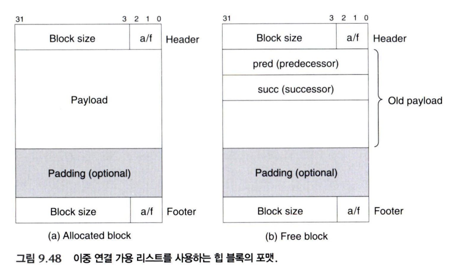

[9.9.12의 묵시적 가용 리스트](/blog/csapp-9-9-12-implicit-allocator)는 블록 크기를 이용해 힙 전체를 순회한다. 구현은 단순하지만 `find_fit`이 할당된 블록까지 모두 지나가야 한다.

```text
[할당][할당][할당][할당][할당][가용][할당][할당]...
  ↑ 여기서부터 하나씩 확인
```

가용 블록을 찾으려는데 이미 사용 중인 블록도 확인하는 것이다. **명시적 가용 리스트(explicit free list)** 는 이 탐색 범위를 가용 블록으로 좁힌다.

## 가용 블록끼리 포인터로 연결한다



<Caption>Notion 원문의 명시적 가용 리스트 블록 구조. 가용 블록 내부 공간을 연결 포인터로 재사용한다.</Caption>

블록이 가용 상태이면 사용자의 데이터를 보존할 필요가 없다. 따라서 예전 페이로드 영역에 연결 리스트용 포인터 두 개를 넣을 수 있다.

- `pred`: 리스트에서 이전 가용 블록을 가리킨다.
- `succ`: 리스트에서 다음 가용 블록을 가리킨다.

할당된 블록은 기존처럼 사용자 데이터를 저장한다. 다시 할당할 블록은 먼저 가용 리스트에서 제거하고, 포인터가 있던 공간을 사용자에게 돌려준다.

## 메모리상의 이웃과 리스트상의 이웃은 다르다

`pred`와 `succ`은 **가용 리스트에서의 순서**다. 물리적으로 바로 앞이나 뒤에 있는 블록이라고 생각하면 안 된다.

```text
메모리 순서: [가용 X][할당][할당][가용 Y][할당][가용 Z]

리스트 순서의 한 예: Z ⇄ X ⇄ Y
```

블록을 합칠 때 필요한 것은 메모리에서 인접한 이웃이므로, 그 이웃은 여전히 헤더·푸터와 경계 태그로 찾는다. 가용 블록을 검색하거나 리스트에서 넣고 뺄 때는 `pred`와 `succ`을 사용한다.

| 작업 | 따라가는 정보 |
| --- | --- |
| 할당할 가용 블록 검색 | 가용 리스트의 `succ` |
| 가용 리스트에서 블록 제거 | `pred`, `succ` |
| 물리적으로 인접한 블록 찾기 | 블록 크기와 경계 태그 |

묵시적 리스트의 탐색 시간이 전체 블록 수에 비례했다면, 명시적 리스트에서는 **가용 블록 수에 비례**한다. 여전히 적합한 블록이 뒤에 있으면 여러 후보를 확인해야 하지만, 할당된 블록은 건너뛴다.

## 반환한 블록을 어디에 넣을까?

가용 블록을 연결하는 방법뿐 아니라 **리스트의 순서를 어떤 정책으로 유지하는지**도 성능과 메모리 이용률에 영향을 준다.

### LIFO: 가장 최근에 반환한 블록을 맨 앞에

새로 반환한 블록을 리스트의 맨 앞에 넣는다. 삽입 위치를 찾을 필요가 없어 포인터 몇 개만 바꾸면 된다.

```text
반환 전: head → X ⇄ Y ⇄ Z
반환 후: head → B ⇄ X ⇄ Y ⇄ Z
```

경계 태그 연결과 기존 가용 블록 제거를 상수 시간에 처리하는 이중 연결 리스트라면, 이런 삽입도 상수 시간에 할 수 있다.

first fit 검색은 가장 최근에 반환한 블록부터 살펴보게 된다. 빠르지만, 이 순서가 메모리 이용률까지 항상 가장 좋게 만드는 것은 아니다.

### 주소 순서: 메모리 주소가 작은 블록부터

리스트를 블록 주소 순서로 유지한다. 단순한 연결 리스트에서는 새 블록이 들어갈 위치를 찾아야 하므로 삽입에 가용 블록 수에 비례하는 시간이 들 수 있다.

주소 순서 정책은 LIFO보다 메모리 이용률에 유리한 경우가 있지만, 실제 결과는 요청 패턴과 배치 정책에 따라 달라진다. “빠른 반환”과 “이후 할당에서의 공간 활용”을 함께 고려해야 한다.

## 연결 포인터 두 개의 비용

일반적인 32비트 환경에서는 포인터 하나가 4바이트이고, 64비트 환경에서는 8바이트다. 이중 연결 리스트이므로 두 포인터를 저장할 공간이 필요하다.

앞선 예제처럼 헤더와 푸터가 각각 4바이트이고 8바이트 정렬을 사용한다면, 64비트 포인터를 저장하는 가용 블록은 최소 다음 공간이 필요하다.

```text
헤더 4 + pred 8 + succ 8 + 푸터 4 = 24바이트
```

다른 메타데이터 구성이나 16바이트 정렬을 사용하면 최소 크기는 더 커질 수 있다.

포인터는 가용 상태일 때만 저장하지만, **작게 할당한 블록도 나중에 반환할 수 있어야 한다.** 따라서 할당 단계부터 이 최소 크기를 만족해야 한다. 작은 요청에서도 큰 블록을 받게 되어 내부 단편화가 늘어날 수 있다.

## 연결할 때는 기존 리스트에서도 제거해야 한다

물리적으로 이웃한 가용 블록들을 합칠 때는 그 블록들이 이미 가용 리스트에 들어 있다는 사실을 잊으면 안 된다.

1. 합칠 가용 이웃들을 리스트에서 제거한다.
2. 합친 크기로 맨 앞 헤더와 맨 뒤 푸터를 갱신한다.
3. 최종 블록 하나를 삽입 정책에 따라 넣는다.

옛 블록의 포인터가 남으면 리스트가 합쳐진 블록의 내부를 가리키게 된다. 할당할 때 블록을 분할하는 경우에도 할당 부분을 제거하고 남은 가용 부분을 다시 연결해야 한다.

다음 [9.9.14의 분리 가용 리스트](/blog/csapp-9-9-14-segregated-free-lists)는 가용 블록을 다시 크기별로 나눠 검색 범위를 더 좁힌다.

---

이 글은 Notion의 [「Jungle Recursion 강의 / CSAPP 9.9.11 ~ 9.11.10」](https://www.notion.so/3ecc1fef77fe80b8bca0c57bdee12d3e) 학습 기록을 바탕으로 정리했다.

## 함께 읽기

- [CSAPP 9.9.11 - 경계 태그로 인접한 가용 블록 합치기](/blog/csapp-9-9-11-boundary-tags)
- [CSAPP 9.9.12 - 간단한 동적 메모리 할당기 구현 읽기](/blog/csapp-9-9-12-implicit-allocator)
- [CSAPP 9.9.14 - 분리 가용 리스트와 버디 시스템](/blog/csapp-9-9-14-segregated-free-lists)
- [CSAPP 9.10 - 가비지 컬렉션과 보수적 Mark & Sweep](/blog/csapp-9-10-garbage-collection)
- [CSAPP 9.11 - C 프로그램에서 만나는 메모리 버그 10가지](/blog/csapp-9-11-c-memory-bugs)
