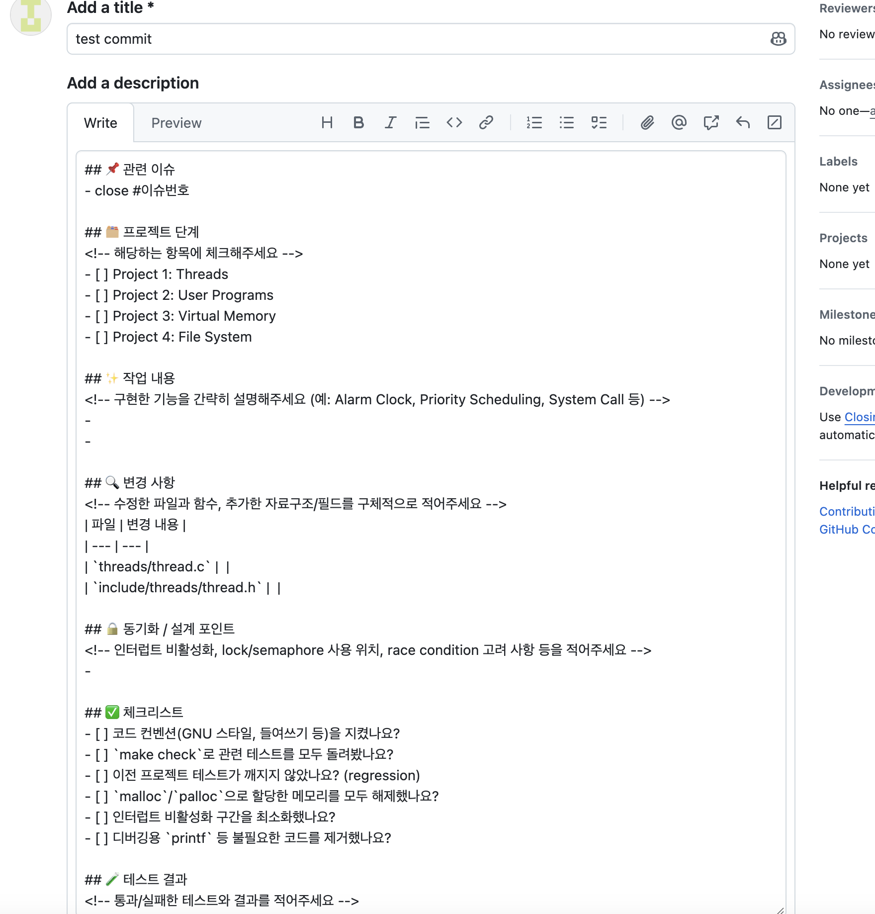
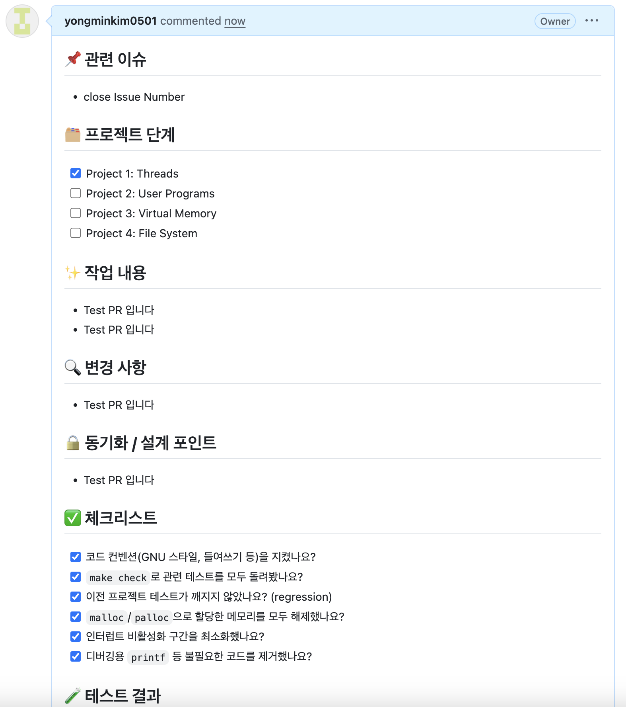

# Github 자동 PR 템플릿 등록 방법
## 들어가며
팀 프로젝트를 하다 보면 PR 본문이 사람마다 제각각
누군가는 한 줄만 쓰고 누군가는 테스트 결과를 빠뜨리고 리뷰어는 매번 "이거 테스트 돌려보셨어요?"라고 물어야 함
GitHub의 **PR 템플릿** 기능을 쓰면 이 문제를 간단히 해결할 수 있음
레포지토리에 템플릿 파일 하나만 추가해 두면 PR을 생성할 때마다 본문이 자동으로 채워짐
## PR 템플릿이란?
PR 템플릿은 Pull Request를 만들 때 본문(description)에 미리 정해둔 양식을 자동으로 넣어주는 GitHub 기능입니다.
- 작성자는 빈칸만 채우고
- 리뷰어는 항상 같은 위치에서 필요한 정보를 확인할 수 있고
- 팀 전체가 체크리스트를 공유하게 됨
## 등록 방법
### 1. `.github` 디렉토리 생성
프로젝트 **루트 디렉토리**에 `.github` 폴더를 만듭니다.
```bash
mkdir .github
```
### 2. `pull_request_template.md` 파일 생성
`.github` 폴더 안에 `pull_request_template.md` 파일을 만듭니다.
```bash
touch .github/pull_request_template.md
```
최종 디렉토리 구조는 다음과 같습니다.
```text
pintos/
├── .github/
│   └── pull_request_template.md
├── threads/
├── userprog/
├── vm/
├── filesys/
└── ...
```
### 3. 템플릿 내용 작성
파일에 원하는 양식을 마크다운으로 작성함
````c
## 📌 관련 이슈
- close #이슈번호

## 🗂️ 프로젝트 단계
<!-- 해당하는 항목에 체크해주세요 -->
- [ ] Project 1: Threads
- [ ] Project 2: User Programs
- [ ] Project 3: Virtual Memory
- [ ] Project 4: File System

## ✨ 작업 내용
<!-- 구현한 기능을 간략히 설명해주세요 (예: Alarm Clock, Priority Scheduling, System Call 등) -->
-
-

## 🔍 변경 사항
<!-- 수정한 파일과 함수, 추가한 자료구조/필드를 구체적으로 적어주세요 -->
| 파일 | 변경 내용 |
| --- | --- |
| `threads/thread.c` |  |
| `include/threads/thread.h` |  |

## 🔒 동기화 / 설계 포인트
<!-- 인터럽트 비활성화, lock/semaphore 사용 위치, race condition 고려 사항 등을 적어주세요 -->
-

## ✅ 체크리스트
- [ ] 코드 컨벤션(GNU 스타일, 들여쓰기 등)을 지켰나요?
- [ ] `make check`로 관련 테스트를 모두 돌려봤나요?
- [ ] 이전 프로젝트 테스트가 깨지지 않았나요? (regression)
- [ ] `malloc`/`palloc`으로 할당한 메모리를 모두 해제했나요?
- [ ] 인터럽트 비활성화 구간을 최소화했나요?
- [ ] 디버깅용 `printf` 등 불필요한 코드를 제거했나요?

## 🧪 테스트 결과
<!-- 통과/실패한 테스트와 결과를 적어주세요 -->
- 통과: `N / M`
- 실패한 테스트:
  -

```bash
# 실행한 명령어
make check
pintos -- -q run alarm-multiple
```

## 🧪 테스트 방법
<!-- 리뷰어가 어떻게 확인하면 되는지 적어주세요 -->
1. `cd threads && make`
2. `cd build && make check`

## 💬 리뷰 요구사항 (선택)
<!-- 설계상 고민했던 부분, 확신이 없는 동기화 처리 등을 적어주세요 -->
-

## 📝 참고 사항
<!-- 남은 이슈, 다음 단계에서 이어서 할 작업, 참고한 자료(GitBook 등) -->
-
````
### 4. 기본 브랜치에 push
템플릿은 **기본 브랜치(main 또는 master)에 반영되어야** 적용됩니다.
```bash
git add .github/pull_request_template.md
git commit -m "chore: PR 템플릿 추가"
git push origin main
```

#### 결과


