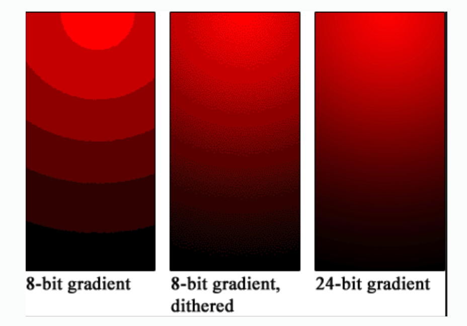
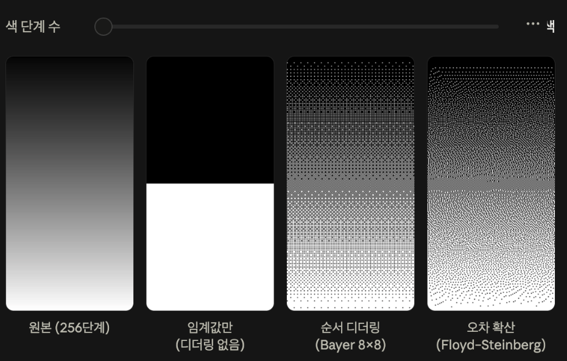
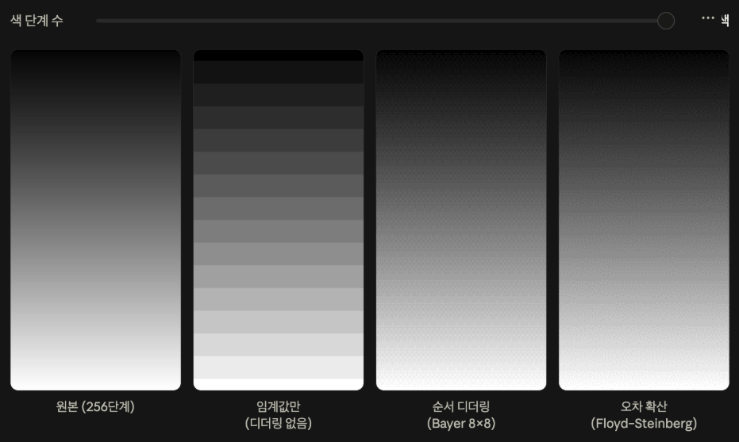
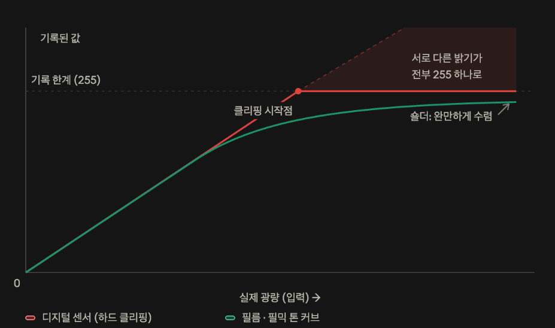

## JPG, JPEG (Joint Photographic Experts Group)

- `RGB` 모드와 `CMYK` 모드 지원
- 웹상 이미지, 사진 정보 전송 시 가장 보편적
- `24 bit`, 수백만 가지 색상 사용

### 단점

- 문자나 선처럼 세밀한 격자 등 고주파 성분이 많은 이미지를 변환하는 과정에선 GIF, PNG 압축보다 품질이 나쁠 수 있음

## GIF (Graphics Interchange Format)

투명 이미지, 움직이는 이미지에 쓰인다.

- `256`색까지 저장할 수 있는 비손실 압축 방법을 사용하여 배경이 투명한 이미지나 움직이는 이미지를 지원

### 단점

- `GIF` 방식으로 저장할 경우 `256`가지 색만 저장 가능하기 때문에 해당 이미지의 색상 정보가 많이 손실됨
- 색상 그라데이션에서 계단 현상이 일어날 수 있음

## PNG (Portable Network Graphics)

비손실 그래픽 파일 포맷으로, 각 포맷 방식의 좋은 기능을 포함한다.

### 장점

- GIF보다 압축률 높음
- 안티앨리어싱과 투명 기능, 비트 심도와 저장 방법 등 다방면에서 지원 가능
- 8비트 알파 채널을 사용해 파일의 투명한 정도를 정의 가능
- GIF보다 부드러운 투명도 지원, JPG보다 깔끔하게 저장

### 단점

- 인터넷 익스플로러 6 이하 웹 브라우저에서는 PNG 형식이 지원되지 않아서 투명한 부분이 회색으로 처리될 수 있음
- 화질이 높을 경우 JPG나 GIF보다 큰 용량으로 저장될 수 있음

---

여기까지가 보통 CS 기초에서 알아야 하는 수준의 JPEG, PNG, GIF라 생각한다. 여기서 한 가지만 더 골라서 알아보자.

이번에 알아볼 개념은 **색상 양자화 알고리즘**이다.

## 색상 양자화 알고리즘

양자화란 넓은 범위의 값을 적은 수의 대표값으로 압축하는 과정이다.

```
원본:
#0000FF #0000FF #0000FF #FF0000
#0000FF #000085 #0000FF #FF0000

압축:
A A A B
A C A B
```

### 색상 테이블

- 자주 쓰는 색을 `A`, `B`, `C`처럼 코드로 저장
- 실제 픽셀은 코드 번호만 기록

### 패턴 압축

`A`가 의미하는 바가 `0000FF`이기 때문에 바꾼다.

이것의 결과는 화질 손실이 없고, 데이터 양은 줄어든다.

그렇다면 이러면 되는 거지, 왜 손실이 생길까?

## 색상 제한

`GIF`는 프레임당 최대 `256`색만 사용 가능하다. 만약 원본 이미지 자체가 수천~수만 가지 색을 사용한다면?

양자화(Quantization) 과정에서 비슷한 색끼리 묶어서 `256` 이내로 줄인다. 그럼 이 경우 시각적인 문제가 발생한다.

### 색 밴딩 (Color Banding)

그라디언트가 뚝뚝 끊기는 현상이다.



### 디더링 (Dithering)

밴딩에 대한 해결책이다. 줄어든 색을 노이즈로 보완하지만, 얼룩처럼 보일 수 있다.



`2번`이 디더링 없이 그라디언트 압축을 진행했을 때다. 그렇기 때문에 저런 식으로 디더링을 통해 최대한 원본의 느낌이 나도록 도와준다.



2가지 색에서 16가지 색으로 확인해보면 조금 더 자주 보던 느낌으로 나게 된다.

### 하이라이트 손실 (클리핑)

예시: 흰 웨딩드레스가 통으로 흰색으로 나타나 디테일이 모두 사라짐.

표현 가능한 최댓값을 넘어선 모든 값은 전부 최댓값 하나로 뭉쳐진다.



초록색 선은 필름이다. 이 경우는 숄더라고 하여 응답 곡선이 완만하게 붙는다. 그렇기 때문에 밝은 부분이 압축될 뿐이지 정보는 남는다.

하지만 빨간색을 보면 어느 순간 탁 끊겨 버린다. 그 이후로는 그저 모두 같은 값만 갖게 된다.

저런 이유로 클로드피셜, 카메라와 게임 엔진은 마지막에 필믹 톤 커브를 씌운다고 한다 (클리핑 직전에 부드럽게 바꿔주는 것).

이거는 보다가 신기해서 가져온 건데, 센서는 빛을 선형으로 기록한다고 한다. 그 말은 `14비트 RAW`를 스톱 단위로 쪼개면, 가장 밝은 1스톱을 `8192`라고 할 때 이보다 한 단계 적은 것은 `4096, ...` 등으로 `2의 N승`이 된다는 뜻이다. 다르게 생각하면 가장 많은 빛이 가장 많은 정보를 점유한다는 것이고, CS적으로 볼 때 클리핑이 날리는 정보는 사실 이미지 자체의 대부분 정보일 수 있다는 의미다.

그럼 이걸 복구하는 것은 불가능한가? 물어본다면 조건부로 가능하다. 채널별로 클리핑 시점이 다르다. 노을 하늘을 찍을 경우 `R` 채널에는 `255`가 박히지만 나머지 두 채널은 아직 여유가 있거나 살아 있는 상태일 수 있다. 그렇기 때문에 살아있는 두 채널을 활용해 `R`을 재구성하게 된다.

## 요약

- JPEG, PNG, GIF의 장단점을 정리했다.
- 손실은 압축(부호화)이 아니라 양자화 단계에서 발생한다.
- 양자화 단계에서 일어나는 대표적인 문제는 색 밴딩과 하이라이트 클리핑이며, 디더링은 밴딩의 해결책이다.
