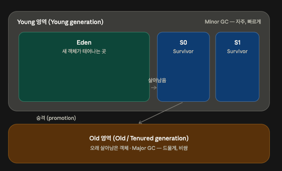
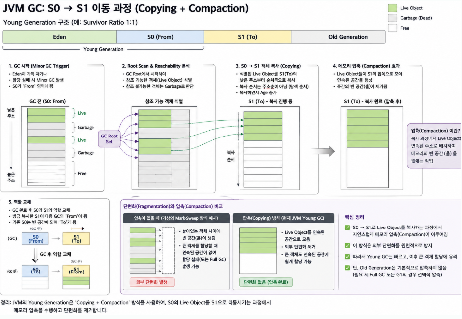

## Garbage Collector 하면 Java

Java의 GC를 알아보자.

`JVM`은 기본적으로 `GC` 알고리즘을 하나만 강제하지 않는다. 필요에 따라 필요한 `GC`를 사용한다.

앞서 나온 `참조 그래프` 개념도 그대로 사용하며, 그 시작점(루트)으로는 스레드 스택 프레임의 지역 변수·파라미터·클래스, 클래스의 static 필드, `JNI`(JVM 위에서 순수 자바로 안 되는 네이티브 코드) 참조, 실행 중인 스레드 객체, 동기화 락을 잡고 있는 객체 등이 있다.

## 세대별 힙 구조가 있다



여기서 보면 `Eden`이라는 공간에서 새로운 객체가 태어난다 (그래서 이름이 에덴이다). 여기서 하나 알아야 하는 것은 대부분의 객체는 **만들어지자마자 죽는다**는 것이다 (약한 세대 가설).

`Eden`의 공간이 꽉 차면 이 중 살아남은 소수의 객체만 `S0` 공간으로 옮긴다. 이때부터 `Minor GC`가 일어난다. 반복되는 `Minor GC`마다 살아있는 객체를 복사하고 쓰던 쪽을 비우는 식으로 `S0` ↔ `S1`을 오가게 된다. 한 번 오갈 때마다 객체의 **나이**가 `+1`이 된다.

이 사이에서 `Minor GC`는 살아 있는 객체를 복사하여 다른 영역에 만들고 쓰던 쪽을 없애는 방식으로 진행된다.

여기서 만약 기본값 `15회`를 넘기면 `Old Generation` 영역으로 넘어간다.

`Old 영역`에서 도는 **`Full GC`**는 비교적 매우 비싼 작업이다. 그렇기 때문에 이 작업 자체를 덜 일으키는 것이 목표가 된다.

### 그럼 여기서 하나 드는 생각은

- 왜 `S0`과 `S1` 두 개로 공간이 나뉘어 있을까?

이는 메모리 압축과 관련이 있다.



`live` 사이에 `garbage`와 `free`가 있게 된다. 이 경우 내가 50만큼의 공간이 필요하더라도, 저런 식으로 버려지는 공간이 10~20씩, 혹은 `free`로 40 이렇게 흩어져 있으면 `50`의 데이터를 저장하기 어렵다. 따라서 `Minor GC`가 일어날 때마다 메모리를 정리하면서 메모리 압축이 함께 일어난다.

### 그러면 객체 공간 자체의 이동이 빈번한데 이 모든 주소를 계속 유지할 수 있나

`Java`는 객체에 `identity`라는 개념이 존재한다.

```java
Object a = new Object();
Object b = new Object();

System.out.println(a == b); // false
```

a와 b는 동일한 구조와 값을 가지고 있더라도 서로 다른 객체다.

### Identity Hash Code

Java는 객체의 identity를 기반으로 한 `int` 형태의 hash 값을 얻을 수 있도록 identity hash code라는 개념을 제공한다.

`HotSpot JVM`(자주 사용되는 코드 영역을 실시간 분석하여 네이티브 코드로 변환·최적화하는 머신)에서는 이 값이 객체 헤더와 연결된다.

```
Java Object
┌──────────────────────────────┐
│ Mark Word                    │
│                              │
│ lock / GC / age /            │
│ identity hash 관련 정보        │
├──────────────────────────────┤
│ Klass Pointer                │
├──────────────────────────────┤
│ field A                      │
│ field B                      │
│ ...                          │
└──────────────────────────────┘
```

주소를 바꾸면 `0x1000` → `0x8000`처럼 값이 바뀌게 되는데, 이때 변하지 않는 값을 유지하기 위해 identity hash code를 활용한다.

이게 모든 객체가 개별 객체임을 완벽하게 보증하지는 못한다 (비둘기집의 원리). 하지만 이전 객체와 변화한 객체가 같은 객체임을 보증하는 것은 가능하다.

### 추가: Java의 `new()`는 `malloc()`보다 빠르다

여기서 놀라운 점은 `JVM`의 객체 할당이 `malloc`보다 빠르다는 것이다.

`malloc`의 경우

- allocator 진입
- size class / free list 선택
- 사용 가능한 block 선택
- pointer 반환

이 일어나지만, `JVM`의 객체 할당은 `Eden` 공간 내에 `TLAB`(Thread Local Allocation Buffer)를 갖고 있어서

- 현재 포인터 읽기
- 객체 크기만큼 증가
- limit 검사

이렇게가 끝이다. 말 그대로 `Thread` 단위 공간이라 락 경쟁도 없다.

## 요약

- Java는 Young (Eden, S0, S1) / Old, 이렇게 2가지 영역으로 관리한다.
- identity hash code를 활용해서 객체를 추적하고 같음을 증명할 수 있다.
- `TLAB` 덕분에 Java의 객체 할당은 `malloc()`보다 빠르다.
