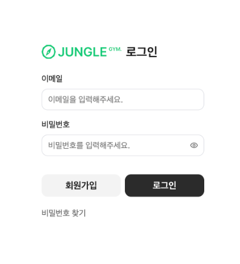
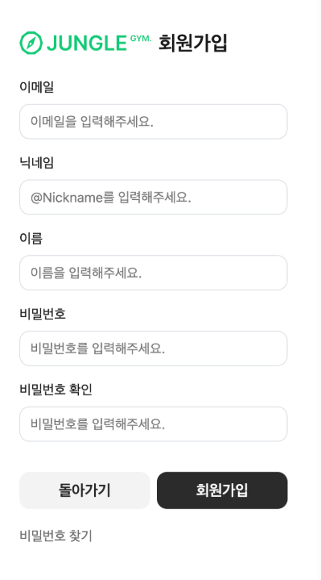
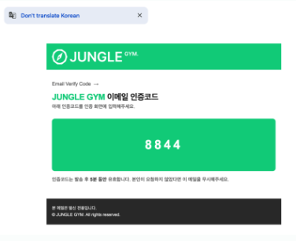
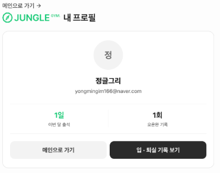
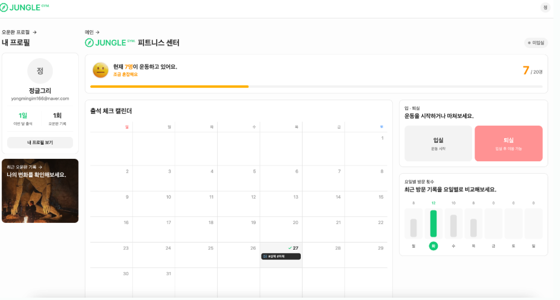
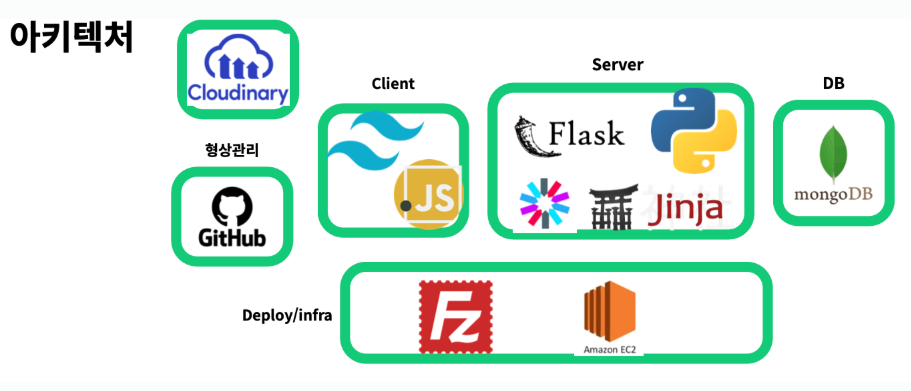

## 프로젝트 개요

**JUMGLE_GYM** — 헬스장 현황 대시보드. SW-AI랩 13기 5팀.

> 건강한 육체에 건강한 정신이 깃든다

단체 생활에서 개인이 누릴 수 있는 쾌적함과, 정글의 커리큘럼을 쫓기 위한 지속 가능한 발전을 추구했다.

서비스 링크는 [junglegym.club](https://junglegym.club)이다.

## 기술 제한

과제로 주어진 제한은 다음과 같았다.

| 영역 | 스택 |
| --- | --- |
| 백엔드 | Python, Flask, Jinja2 |
| 인프라 | MongoDB, AWS |
| 프론트 | HTML, CSS, 부트스트랩, JavaScript, jQuery, AJAX |

필수 포함 사항은 로그인 기능과 Jinja2 템플릿 엔진 사용이었다.

## 구현 범위

**Auth**

- 로그인, 회원가입
- 비밀번호 초기화
- 이메일 인증

**Gym**

- 입실, 퇴실 기능 구현
- 현재 입실 상태 조회
- 퇴실 시 오운완 사진 저장
- 입퇴실 정보 누적 저장

**Images**

- Cloudinary 연결
- Image Cloud API를 통한 저장과 조회
- API 연결 여부 확인 및 예외처리

**User**

- 기본 CRUD
- 입퇴실 상태 status 유지
- 프로필 사진 Secure URL 저장

**QR**

- QR을 통한 페이지 접근
- QR을 통한 자동 로그인
- 자동 로그인 이후 간단한 입실, 퇴실 버튼

## 실제 구현 화면

### 로그인

### 회원가입

### 이메일 인증

### 마이페이지

### 메인 페이지

## 트러블슈팅

### SSR 라우팅에 대한 이해 부족

SSR을 위한 URL 라우팅을 이해해야 했는데, 전체 그림에 대한 이해가 크게 부족하다고 느꼈다. 프론트를 맡은 분께 거의 하루 종일 여쭤보고 피드백을 받았다.

### 나는 웹 백엔드 개발을 하고 있었나

FastAPI를 주로 쓰면서 웹 백엔드 개발을 한다고 생각해왔다. 그런데 정확히 말하면 FastAPI를 API 엔드포인트를 만드는 용도로만 써온 것에 가까웠다.

잘못된 사용이라고 할 수는 없지만, 그렇다고 웹 백엔드 개발의 시선으로 사용했다고 말할 수도 없을 것 같다.

### NoSQL을 RDB처럼 쓰다

MongoDB는 NoSQL인데 실제로는 RDB처럼 사용했다. MongoDB를 경험해본 팀원은 그냥 다 넣어도 된다고 했지만 그렇게 사용하지 않았다. 정확히는 하지 못했다.

이 차이가 구조에서 드러났다. NoSQL 기반 MVC라면 Repository가 하나의 Collection에 의존하는 형태로 잡아야 한다고 구상했는데, RDB처럼 생각하다 보니 Repository가 너무 많이 생겼고 구조가 오히려 난잡하고 복잡해졌다.

### 병합의 어려움

위 문제들이 겹치면서, MVC 구조에 익숙하지 않은 팀원의 코드를 병합하는 과정에서 꽤 어려움을 겪었다.

## 발표

> 냉정하게 말하면 발표는 실패했다.

정글은 입소해서 함께 실패하며 배우는 곳이다. 결과 발표도 마찬가지다. 실패할 가능성은 분명히 있고 거기서 배우면 그만이다.

문제는 다른 데 있었다. 2박 3일 동안 쉬지 않고 개발해서 나온 결과물에 대해 제대로 피드백을 받지 못했고, 그게 발표 준비가 미흡했던 이유였다. 순수하게 우리 팀의 준비가 다른 팀보다 부족했다고 생각한다.

우리가 들인 노력에 비해 보편적인 시선에서의 성과는 적었다. 다만 이런 실수는 다시 하지 않으면 된다.

## 아키텍처

## 회고

팀플을 하면서 따로 팀장이 있지는 않았다. 다 같이 문제를 만나고, 그 문제를 잘 푸는 팀원이 있으면 그 사람이 그 문제의 팀장이 되는 느낌이었다.

우리는 늘 리더의 리더십에만 관심을 갖고 배우려 하며, 누군가 위에서 이끄는 그림만 생각하는 것 같다. 하지만 역설적으로 리더의 리더십뿐 아니라 팔로워들의 팔로워십도 리더에게, 그리고 팀원들에게 필요하다고 생각한다.

결국 이렇게 정리된다.

> 내가 무엇을 아느냐, 그리고 무엇을 모르느냐를 확실하게 아는 것이 중요하다.

## 접근 방법

서비스 링크: [junglegym.club](https://junglegym.club)

서비스 QR

