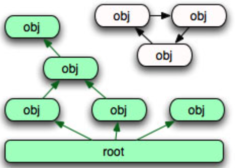

해당 알고리즘은 `mark & sweep`으로 Garbage Collector에 사용되는 알고리즘 중 하나이다.

## Mark & Sweep

- **Mark**: 루트에서 시작해서 도달 가능한 모든 객체를 표시한다.
- **Sweep**: 표시되지 않은 객체(도달 불가능한 객체)를 모두 회수한다.

그러면 우리는 도달 가능성 그래프를 어떻게 만들 수 있을까.

- 객체 하나하나가 노드가 된다.
- 객체가 다른 객체를 참조하면 그 사이에 간선이 생긴다.
- 루트에서부터 간선을 따라가서 닿지 않는 노드가 도달 불가능한 노드다.

그럼 이 중에서 무엇이 루트가 될 수 있을까?

**루트가 될 수 있는 것은 스택 프레임의 지역 변수, 전역 변수, 그리고 C 레벨의 참조다.**

이 셋을 루트로 잡는 이유는 간단하다. 이들은 다른 어떤 객체로부터도 참조되지 않으면서, 프로그램이 언제든 직접 접근할 수 있는 시작점이기 때문이다. 힙 안의 객체들은 서로를 참조하며 그래프를 이루지만, 그 그래프에 처음 진입하는 지점은 결국 힙 바깥에 있어야 한다.

루트가 되는 것은 크게 세 부류이다.

- **스택 프레임의 지역 변수**
  - 함수가 실행 중일 때 그 프레임 안에 있는 지역 변수들
  - 함수 호출이 끝나 프레임이 사라지면 루트에서도 제외된다
- **전역 변수**
  - 모듈 레벨에 정의된 변수들
  - 프로그램이 살아있는 동안 계속 루트로 남는다
- **C 레벨의 참조**
  - CPython 인터프리터나 C 확장 모듈이 내부적으로 들고 있는 참조
  - 파이썬 코드에서는 보이지 않지만 인터프리터 입장에서는 명백한 시작점이다

## 요약

- Mark & Sweep은 루트에서 도달 가능한 객체를 표시(Mark)하고, 표시되지 않은 객체를 회수(Sweep)하는 방식이다.
- 도달 가능성은 객체를 노드로, 참조를 간선으로 하는 그래프로 표현할 수 있다.
- 루트는 스택 프레임의 지역 변수, 전역 변수, C 레벨의 참조 세 부류로 나뉜다.
