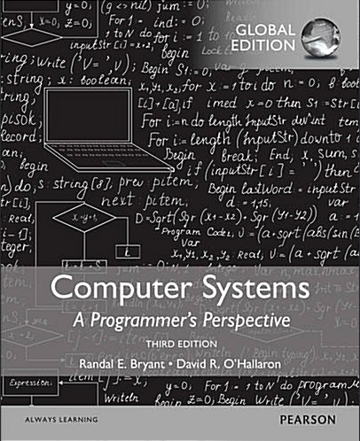

## Garbage Collector



### Chapter.9 가상메모리 9.10 가비지 컬렉터 p.833

> 가비지 컬렉터는 더 이상 프로그램에서 사용하지 않는 블록들을 자동으로 반환하는 동적 저장장치 할당기다.

## 파이썬의 GC는 어떻게 작동할까?

파이썬의 GC는 참조 카운팅은 주력, 추적 GC는 보조의 역할을 한다.

### 참조 카운팅

- Python 내의 모든 객체는 자기를 가리키는 참조의 개수를 들고 있음
- 카운터가 0이 되는 순간 바로 메모리가 해제된다

**장점**

- 해제 시점이 즉각적이고 예측이 가능하다.
- 긴 STW(Stop the world)가 없다.
  - 여기서 STW는 GC가 힙을 정리하는 동안 애플리케이션 스레드가 모두 멈추는 것을 의미 (STW 시간 연산 구조는 다음 글에)

**단점**

- 참조마다 카운트 갱신 (오버헤드)
- 순환 참조를 회수하는 것이 불가능하다
- 카운트를 저장하기 때문에 추가적인 메모리를 사용한다.

### 순환참조 세대별 GC

```python
a = {}
b = {}
a['b'] = b
b['a'] = a
del a, b
```

이러한 경우 영원히 살아있게 되면서 GC 작동을 하지 않는다.

### GC 모듈과 컨테이너 객체

이를 해결하기 위해서 GC 모듈이 컨테이너 객체만을 대상으로 작동을 하게 됨.

컨테이너 객체란, `for ... in`을 돌릴 수 있는 객체들을 의미하며 내부적으로 `__contains__`라는 메소드를 가지고 있는 객체를 의미한다.

이전 편에 적었던 서브 클래스 이야기 중 `Container`와 서브 클래스 관계에 있는 객체를 의미한다.

세대 0, 1, 2가 있고 새 객체는 0세대가 된다. 이때 수집에서 살아남게 되면 다음 1세대가 된다.

트리거는 힙 사용량이 아닌 할당 횟수와 해제 횟수의 임계값으로 한다.

기본값은 (100, 10, 10)으로 각각 0세대 100, 1세대 10, 2세대 10이 된다.

### 이거 성능적으로 좋나?

당연히 안 좋다.

그렇기 때문에 인스타그램에서

```python
gc.disable()
```

를 통하여 성능 개선한 것도 있다.

## 결론

- 파이썬의 GC는 참조 카운트 방식을 사용한다.
- 추가적으로 세대라는 개념을 추가하여 이를 통해 GC의 사용각을 본다.
