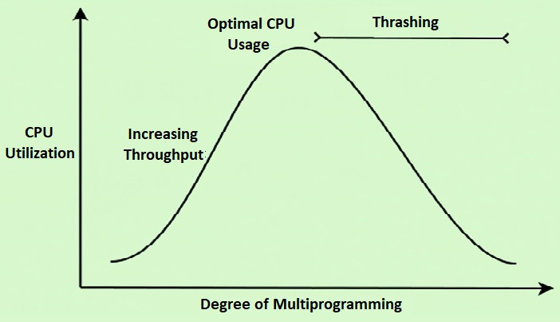

## 스레싱이란

**스레싱(Thrashing)** 은 OS의 가상 메모리 환경에서 프로세스가 실제 작업보다 페이지를 내보내고 다시 가져오는 데 대부분의 시간을 쓰는 상태를 말한다.



<Caption>Notion 원문에 첨부한 개념도. 프로세스를 더 많이 실행한다고 CPU 이용률이 계속 높아지는 것은 아니다.</Caption>

이 문제가 왜 생기는지 이해하려면 가상 메모리와 페이지 폴트부터 살펴볼 필요가 있다.

## 가상 메모리와 요구 페이징

가상 주소 공간은 물리 메모리보다 훨씬 클 수 있다. 주소 공간의 크기는 설치된 메모리의 양이 아니라 주소를 표현하는 비트 수와 시스템이 지원하는 주소 범위로 정해지기 때문이다.

넓은 주소 공간을 갖는다고 그만큼의 물리 메모리를 처음부터 차지하는 것은 아니다. 사용하는 영역에 필요한 자원을 연결하므로, 가상 주소 공간에는 매핑되지 않은 빈 영역도 많다.

프로그램은 이런 주소 공간을 사용하고, OS는 필요한 페이지를 메모리에 올린다. 디스크에 있는 페이지도 실제로 접근할 때 가져올 수 있는데, 이처럼 필요해질 때 페이지를 준비하는 방식이 **요구 페이징(demand paging)** 이다.

여기서 **페이지(page)** 는 가상 주소 공간을 고정된 크기로 나눈 단위다. 물리 메모리에서 페이지가 들어갈 자리는 **페이지 프레임(frame)** 이라고 한다. 아래 예시에서는 이 프레임을 간단히 “메모리 칸”이라고 부르겠다.

### 찾고 있는 페이지가 DRAM에 없다면?

접근하려는 유효한 페이지가 현재 물리 메모리에 올라와 있지 않으면 **페이지 폴트(page fault)** 가 발생한다. 가상 메모리를 디스크의 데이터를 DRAM에 캐시하는 관점으로 보면 일종의 캐시 미스로 이해할 수 있다.

이 글에서는 디스크에 있는 페이지를 가져와야 하는 상황을 생각한다. 메모리에 빈자리가 없다면 다른 페이지를 내보내고 필요한 페이지를 올려야 한다. 디스크 I/O는 메모리 접근보다 훨씬 느리므로 이런 일이 반복되면 실행 시간에 큰 영향을 준다.

> 모든 페이지 폴트가 디스크 읽기를 일으키는 것은 아니다. 여기서는 스레싱을 설명하기 위해 디스크에서 페이지를 가져오는 경우에 초점을 맞춘다.

## 평소에는 지역성이 문제를 줄여준다

프로그램은 보통 어느 순간에 전체 페이지를 고르게 쓰지 않고, 일부 페이지를 집중해서 사용한다. 최근 일정 구간에 참조한 페이지들의 집합을 **워킹 셋(working set)** 이라고 한다.

이 페이지들이 메모리에 들어가면 한 번 올린 데이터를 여러 번 재사용할 수 있다. 지역성 덕분에 매번 디스크를 찾아갈 필요가 없는 것이다.

그런데 **자주 쓰는 페이지들조차 메모리에 다 들어가지 못하면 어떻게 될까?** 이것이 스레싱으로 이어지는 조건이다.

## 메모리는 4칸인데 필요한 페이지는 5개라면

먼저 필요한 페이지가 메모리 칸보다 적거나 같은 경우를 생각해보자. 처음 페이지를 올릴 때 폴트가 발생하더라도, 이후 같은 페이지들을 계속 사용하고 메모리에 유지할 수 있다면 다시 가져올 필요가 없다.

반대로 메모리는 4칸인데 페이지 5개를 반복해서 참조한다고 해보자. 교체 정책은 **LRU(Least Recently Used)** 로, 가장 오랫동안 사용하지 않은 페이지를 내보낸다.

아래 목록은 왼쪽이 가장 오래전에 사용한 페이지이고, 오른쪽이 가장 최근에 사용한 페이지다. 처음에는 `1, 2, 3, 4`가 들어 있으며, 이후 `5, 1, 2, 3, 4` 순서로 계속 접근한다.

```text
메모리 [1 2 3 4] 상태에서

5 접근 → 없음! 폴트 → 1을 내보냄 → [2 3 4 5]
1 접근 → 없음! 폴트 → 2를 내보냄 → [3 4 5 1]
2 접근 → 없음! 폴트 → 3을 내보냄 → [4 5 1 2]
3 접근 → 없음! 폴트 → 4를 내보냄 → [5 1 2 3]
4 접근 → 없음! 폴트 → 5를 내보냄 → [1 2 3 4]
5 접근 → 없음! 폴트 → 1을 내보냄 → [2 3 4 5]
...
```

극단적인 접근 패턴이지만, **접근할 때마다 페이지 폴트가 발생한다.** 방금 내보낸 페이지를 곧바로 다시 가져와야 하기 때문이다.

자주 쓰는 페이지가 가용 메모리보다 많으면, 현재 메모리에 있는 페이지 중 무엇을 희생자로 골라도 가까운 시점에 다시 필요해질 수 있다. 교체를 열심히 해도 실제 작업은 거의 진전되지 않는다.

디스크에서 페이지를 가져오는 동안 해당 프로세스는 기다린다. 다른 실행 가능한 작업도 부족해지면 CPU의 유용한 작업량까지 줄어든다.

## 프로세스를 더 넣으면 해결될까?

다중 프로세스 환경에서는 여러 프로세스가 물리 메모리를 나눠 쓴다. 동시에 실행하는 프로세스가 많아지면 각 프로세스의 워킹 셋을 유지할 공간이 부족해질 수 있다.

이때 CPU 사용량 하나만 보고 “CPU가 여유로우니 프로세스를 더 넣자”라고 판단하면 문제가 악화될 수 있다.

1. 프로세스들이 메모리를 나눠 쓰면서 필요한 페이지를 유지하지 못한다.
2. 페이지 폴트와 디스크 대기가 늘어난다.
3. CPU 이용률이 낮아진다.
4. 이를 여유 자원으로 오해해 프로세스를 더 투입한다.
5. 메모리 부족이 심해지고 페이지 교체가 더 잦아진다.

처음의 그래프는 이런 상황을 설명하는 개념도다. **CPU 이용률이 낮다는 관찰만으로 시스템에 여유가 있다고 결론 내릴 수는 없다.**

## 해결의 방향: 워킹 셋이 메모리에 들어가게 만들기

문제를 단순화하면 자주 사용하는 페이지들의 합이 가용 메모리보다 크다는 것이다. 그러면 해결 방향도 두 가지로 볼 수 있다.

- 동시에 필요한 페이지를 줄이거나, 실행 중인 프로세스에 필요한 메모리를 확보한다.
- 사용할 수 있는 물리 메모리를 늘린다.

책에서 언급한 방식 중 하나가 **워킹 셋 모델**이다.

각 프로세스가 최근에 어떤 페이지를 사용하는지 추적하고, 실행할 프로세스들의 워킹 셋이 가용 메모리에 들어갈 수 있도록 다중 프로그래밍 정도를 조절한다. 메모리가 부족하면 일부 프로세스의 실행을 보류하거나 중단하고, 회수한 메모리를 나머지 프로세스에 배분한다.

핵심은 모든 프로세스를 조금씩 진행시키려다 모두가 페이지 교체만 반복하게 만드는 대신, **실행할 프로세스가 자주 쓰는 페이지를 메모리에 유지하도록 하는 것**이다. 실제 워킹 셋은 시간에 따라 달라지므로 계속 관찰하고 조절해야 한다.

## 발표를 준비하며 생각하게 된 점

지난주 코치님 피드백을 통해 특정 최적화가 모든 상황에서 최선의 방식은 아니라는 점을 생각하며 발표를 준비했다.

이번 문제에서도 상황을 악화시키는 이유 중 하나는 CPU 사용량만 보고 시스템이 여유롭다고 판단하는 것이었다. CPU가 쉬는 이유가 할 일이 없어서인지, 메모리나 I/O를 기다리기 때문인지 구분해야 했다.

현대 시스템에서 참고할 수 있는 구체적인 예로 Linux의 **PSI(Pressure Stall Information)** 가 있다. CPU·메모리·I/O 자원 부족으로 작업이 멈춰 있는 시간을 제공하므로, CPU 이용률만으로 드러나지 않는 자원 압박을 살펴볼 수 있다. [Linux 커널 PSI 문서](https://docs.kernel.org/accounting/psi.html)

큰 방향은 여전히 실행할 작업과 필요한 자원의 양을 조절하는 것이지만, 상황을 판단하는 지표는 더 다양해진다.

책으로 CS를 공부하다 보면 하나의 이론과 과정을 설명하기 위해 여러 변수를 통제한 상황을 다룬다는 생각이 들 때가 있다. 그 전제를 생각하며 읽는 것과, 설명을 모든 상황에 그대로 적용하는 것은 차이가 크다.

앞으로는 “이 문제의 정답은 무엇일까?”에서 한 걸음 더 나아가, **“내가 설계한 것이 이런 상황에서도 견딜 수 있을까? 견디지 못한다면 원인은 어디에서 시작됐을까?”** 를 찾아가는 과정을 중요하게 생각하려고 한다.

---

이 글은 Notion의 [「Jungle Recursion 강의 / 문제 소개: 스레싱(Thrashing)이란」](https://www.notion.so/3eac1fef77fe80a8a4b3c4ffbe6e9796)을 바탕으로 정리했다.
